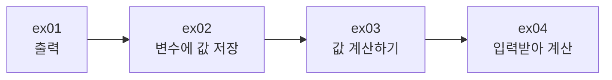

# FirstJava — 첫 자바 프로그램 · 변수 · 연산자 · 입력

> 📅 과정 첫 주 | 🧭 [전체 로드맵으로](../README.md) | ▶ 다음: [Hello](../Hello/README.md)

자바 프로그램의 **기본 골격(`class` + `main`)** 을 익히고, 값을 저장하는 **변수**, 값을 계산하는 **연산자**,
키보드로 값을 받는 **`Scanner`** 까지 다룹니다. 이후 모든 프로젝트의 출발점입니다.

---

## 1. 이 프로젝트에서 배우는 것

- 자바 프로그램의 실행 시작점 `public static void main(String[] args)`
- 화면 출력 `System.out.println()` / `System.out.print()`
- 주석 (`//`, `/* */`)과 **명명 규칙** (클래스 = 파스칼/카멜, 변수 = 소문자 시작 카멜, DB = 스네이크)
- 자료형: `int`, `long`, `float`, `double`, `String`
- 산술(`+ - * / %`) · 관계(`> < >= <= == !=`) · 대입(`+=`) · 증감(`++`) 연산자
- **전위(`++a`) vs 후위(`a++`)** 연산자의 차이
- `Scanner`로 정수 입력받기

## 2. 폴더 구조

```
FirstJava/src/
├── ex01/Hello.java          첫 출력
├── ex02/VariableEx01.java   변수 선언·대입·출력
├── ex03/VariableEx02.java   연산자, 전위/후위 증감
└── ex04/VariableEx03.java   Scanner 입력 → 초를 시/분/초로 변환
```

## 3. 학습 흐름



출력 → 저장 → 계산 → 입력 순서로, **프로그램 = 입력 → 처리 → 출력** 구조를 완성합니다.

---

## 4. 예제별 상세

### ex01 · `Hello.java` — 첫 프로그램
```java
public class Hello {
    public static void main(String[] args) {
        System.out.println("Hello, Java 21!");
        System.out.println("안녕하세요!!");
    }
}
```
- 파일명(`Hello.java`)과 `public class` 이름(`Hello`)은 **반드시 같아야** 합니다.
- `main` 메소드는 JVM이 가장 먼저 호출하는 진입점입니다.

**실행 결과**
```
Hello, Java 21!
안녕하세요!!
```

### ex02 · `VariableEx01.java` — 변수
```java
int age;          // 선언 (자료형 + 변수명)
age = 20;         // 대입
double eng = 78.4;   // 선언과 동시에 초기화
String name = "김대철";
```
| 분류 | 자료형 | 크기 | 예 |
|---|---|---|---|
| 정수 | `int` / `long` | 4 / 8 byte | `20`, `2500000000L` |
| 실수 | `float` / `double` | 4 / 8 byte | `10.1f`, `97.3` |
| 문자열 | `String` | 참조형 | `"김대철"` |

- 주석에 **카멜 표기법**(`SaleOrder`, `saleOrder`)과 **스네이크 표기법**(`sale_order`, DB용) 비교가 정리되어 있습니다.
- `"나이 : " + age` 처럼 문자열 + 숫자는 **문자열 연결**이 됩니다.

**실행 결과**
```
나이 : 20
국어점수 : 97.3
영어점수 : 78.4
이름 : 김대철
```

### ex03 · `VariableEx02.java` — 연산자
```java
System.out.println(5 / 2.);   // 2.5  (정수/실수 → 실수)
System.out.println(5 % 2);    // 1    (나머지)
System.out.println(5 == 5);   // true

int a = 5;
a = a + 1;  // 6
a += 1;     // 7
a++;        // 8 (후위)
++a;        // 9 (전위)

int b = 10;
int c = b++;   // c = 10, 그 다음 b = 11   ← 먼저 대입, 나중에 증가
int d = ++b;   // b = 12, 그 다음 d = 12   ← 먼저 증가, 나중에 대입
```
- **연산 결과 타입 규칙**: 정수⊕정수 → 정수, 실수가 하나라도 있으면 → 실수
- `=`는 "같다"가 아니라 **오른쪽 값을 왼쪽에 대입**
- Eclipse 팁: 줄 복사 `Ctrl + Alt + ↓`

**실행 결과**
```
2.5
5 % 2 나머지 : 1
false
true
true
9
선 후 연산자
12      ← b
10      ← c (b++ : 증가 전 값)
12      ← d (++b : 증가 후 값)
```

### ex04 · `VariableEx03.java` — Scanner로 입력받아 시/분/초 변환
```java
Scanner sc = new Scanner(System.in);
int totalSeconds = sc.nextInt();

int hour          = totalSeconds / 3600;   // 몫 → 시간
int remainSeconds = totalSeconds % 3600;   // 나머지 → 남은 초
int minute        = remainSeconds / 60;
int second        = remainSeconds % 60;
sc.close();
```
- `/`(몫)와 `%`(나머지)를 조합하는 대표적인 **단위 변환 패턴**입니다.

**실행 예** (입력 `3725`)
```
초를 입력하세요: 3725
1시간 2분 5초
```

---

## 5. 핵심 개념 정리

| 개념 | 한 줄 요약 |
|---|---|
| `main` | 프로그램 시작점. `public static void main(String[] args)` |
| 변수 | 값을 저장하는 이름 붙은 공간. `자료형 이름 = 값;` |
| 정수 나눗셈 | `5 / 2 == 2` (소수점 버림). 실수 결과를 원하면 한쪽을 실수로 |
| `%` | 나머지. 짝수 판별(`n % 2 == 0`), 배수 판별, 단위 변환에 활용 |
| `a++` vs `++a` | 단독 사용 시 같음. **식 안에서** 쓰면 대입 시점이 다름 |
| `Scanner` | `import java.util.Scanner;` → `nextInt()`, `nextLine()` … 사용 후 `close()` |

## 6. 주의할 점

- `Scanner`에 정수가 아닌 값을 입력하면 `InputMismatchException`이 발생합니다. → [예외처리](../Java20260522-예외처리/README.md)에서 해결 방법을 다룹니다.
- 출력 문자열이 `"Hello, Java 21!"` 이지만 Java 17에서도 문제없이 실행됩니다 (단순 문자열).

## 7. 연결

- ▶ 다음 단계: [Hello](../Hello/README.md) — `final` 상수와 **형변환**, 그리고 형변환 시 생기는 **값 손실(오버플로)**
- 여기서 배운 `%`, `++`, `+=`는 [제어문](../Java20260513-제어문/README.md)의 반복문에서 계속 쓰입니다.
