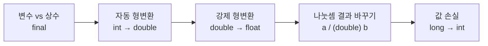

# Hello — 상수 · 형변환 · 오버플로

> 📅 과정 첫 주 | 🧭 [전체 로드맵으로](../README.md) | ◀ 이전: [FirstJava](../FirstJava/README.md) | ▶ 다음: [제어문](../Java20260513-제어문/README.md)

변하지 않는 값인 **상수(`final`)** 와, 서로 다른 자료형 사이에서 값을 옮길 때 일어나는
**자동 형변환 / 강제 형변환**, 그리고 강제 형변환에서 발생하는 **값 손실**을 확인합니다.

---

## 1. 이 프로젝트에서 배우는 것

- `final` 키워드로 상수 만들기 (관례: 대문자 이름 `PI`)
- **자동 형변환** (작은 타입 → 큰 타입, 손실 없음)
- **강제 형변환(캐스팅)** (큰 타입 → 작은 타입, `(타입)` 필요, 손실 가능)
- 정수 나눗셈을 실수 나눗셈으로 바꾸는 방법
- `long` → `int` 강제 변환 시 **오버플로**

## 2. 폴더 구조

```
Hello/src/
└── ex01/SampleEx.java   상수, 형변환 종합 예제
```

## 3. 학습 흐름



---

## 4. 예제 상세 · `SampleEx.java`

### ① 변수와 상수
```java
int age = 0;                // 변경 가능
final double PI = 3.14159;  // 변경 불가 (다시 대입하면 컴파일 에러)
age = age + 1;
```

### ② 자동 형변환 vs 강제 형변환
```java
double douD = 10.1;
float  f1   = 10.1f;   // float 리터럴은 f 접미사 필요
int    intA = 10;

douD = intA;           // ✅ 자동: int(4) → double(8)
// f1 = douD;          // ❌ 컴파일 에러: double → float 은 손실 가능
f1 = (float) douD;     // ✅ 강제 형변환
```

자료형 크기 순서 (자동 형변환 방향 →)
```
byte → short → int → long → float → double
```

### ③ 나눗셈 결과 바꾸기
```java
int b = 3;
System.out.println(intA / b);          // 3                (정수 / 정수)
System.out.println(intA / (double) b); // 3.3333333333333335 (정수 / 실수)
```

### ④ 강제 형변환에 의한 값 손실 (오버플로)
```java
long longA = 2500000000L;   // int 범위(약 ±21억)를 넘는 값, L 접미사 필수
int  intB  = (int) longA;   // 상위 비트가 잘려 나감
System.out.println(intB);   // -1794967296  ← 엉뚱한 음수
System.out.println(longA);  // 2500000000
```
`2,500,000,000 − 2³² = −1,794,967,296` — 32비트로 잘리면서 부호 비트가 1이 되어 음수가 됩니다.

### 실행 결과
```
Hello, Java 21!
3
3.3333333333333335
-1794967296
2500000000
```

---

## 5. 핵심 개념 정리

| 구분 | 방향 | 문법 | 값 손실 |
|---|---|---|---|
| 자동 형변환 (promotion) | 작은 → 큰 | `double d = intValue;` | 없음 |
| 강제 형변환 (casting) | 큰 → 작은 | `int i = (int) longValue;` | **있을 수 있음** |

- `int` 범위: −2,147,483,648 ~ 2,147,483,647 (약 ±21억)
- 정수 리터럴 기본형은 `int`, 실수 리터럴 기본형은 `double`
  → `long`은 `L`, `float`은 `f` 접미사를 붙입니다.

## 6. 주의할 점

- `double ex = 1.2 + 10;` → `10`이 자동으로 `10.0`으로 변환되어 `11.2`
- `(double)(intA / b)` 는 **이미 정수 나눗셈이 끝난 뒤** 변환하므로 `3.0`입니다. 괄호 위치가 중요합니다.
- 이 형변환 개념은 이후 **객체 형변환(업캐스팅/다운캐스팅)** 으로 확장됩니다 → [상속](../Java20260519-상속/README.md), [인터페이스 ex04](../Java20260521-인터페이스/README.md)

## 7. 연결

- ▶ 다음 단계: [제어문](../Java20260513-제어문/README.md) — 조건에 따라 다른 코드를 실행하고, 같은 코드를 반복합니다.
- `(int)(Math.random() * 100) + 1` 처럼 **실수 난수를 정수로 강제 변환**하는 패턴이 제어문·배열에서 계속 등장합니다.
