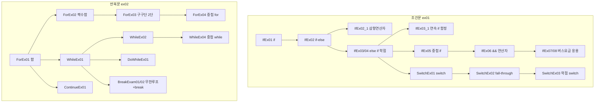

# Java20260513-제어문 — 조건문 · 반복문

> 📅 2026-05-13 | 🧭 [전체 로드맵으로](../README.md) | ◀ 이전: [Hello](../Hello/README.md) | ▶ 다음: [배열](../Java20260514-배열/README.md)

프로그램의 **실행 순서를 바꾸는** 두 가지 도구를 배웁니다.
- `ex01` **조건문** — 조건에 따라 *다른* 코드를 실행 (`if`, 삼항연산자, `switch`)
- `ex02` **반복문** — *같은* 코드를 여러 번 실행 (`for`, `while`, `do-while`, `break`, `continue`)

---

## 1. 이 프로젝트에서 배우는 것

- `if` / `if-else` / `if-else if-else` 세 가지 형태
- 중괄호 `{}` 생략 규칙 (한 문장일 때만)
- **연속 `if` vs `else if`** 의 결정적 차이
- 중첩 `if` ↔ 논리연산자 `&&`, `||` 로 바꾸기
- 삼항(조건) 연산자 `조건 ? 참값 : 거짓값`
- `switch`와 `break`, **fall-through**, `case` 묶기
- `Math.random()`으로 난수 만들기
- `for`, `while`, `do-while` 실행 순서와 차이
- 무한 루프 `while(true)` + `break`, 건너뛰기 `continue`
- 중첩 반복문 (구구단)

## 2. 폴더 구조

```
Java20260513-제어문/src/
├── ex01/  ── 조건문
│   ├── IfEx01.java       if 단독
│   ├── IfEx02.java       if-else
│   ├── IfEx02_1.java     삼항 연산자
│   ├── IfEx03.java       if-else if (학점)
│   ├── IfEx03_1.java     연속 if 의 함정 (난수 점수)
│   ├── IfEx04.java       if-else if + 중괄호 모두 사용
│   ├── IfEx05.java       중첩 if (국어·영어 합격)
│   ├── IfEx06.java       && 로 중첩 if 대체
│   ├── IfEx07.java       버스 요금 계산
│   ├── IfEx08.java       버스 요금 + 난수 나이 + ||
│   ├── SwitchEx01.java   switch + break
│   ├── SwitchEx02.java   break 없는 switch (fall-through)
│   └── SwitchEx03.java   switch 로 학점 계산 (점수/10)
└── ex02/  ── 반복문
    ├── ForEx01.java      1~5 합
    ├── ForEx02.java      1~100 짝수 합
    ├── ForEx03.java      구구단 2단
    ├── ForEx04.java      중첩 for 구구단 (삼각형)
    ├── WhileEx01.java    while 1~5 합
    ├── WhileEx02.java    while 짝수 합
    ├── WhileEx04.java    중첩 while 구구단 2~5단
    ├── DoWhileEx01.java  do-while
    ├── BreakExam01.java  무한 루프 + break (주사위)
    ├── BreakExam02.java  합이 10000 넘는 순간 break
    └── ContinueEx01.java 3의 배수 건너뛰기
```

## 3. 학습 흐름



같은 문제(1~5 합, 짝수 합, 구구단)를 **for / while / do-while** 로 각각 풀어 보며 차이를 비교하는 구성입니다.

---

## 4. 예제별 상세 — ex01 조건문

### IfEx01 → IfEx02 · if / if-else
```java
int age = 15;
if (age >= 20)
    System.out.println("당신은 성인입니다.");   // 조건이 거짓이면 아무것도 안 함
System.out.println("프로그램 종료!!");
```
```java
if (age >= 20) System.out.println("당신은 성인입니다.");
else           System.out.println("당신은 미성인입니다.");
```
| 파일 | 입력값 | 결과 |
|---|---|---|
| IfEx01 | `age = 15` | `프로그램 종료!!` 만 출력 |
| IfEx02 | `age = 25` | `당신은 성인입니다.` |

### IfEx02_1 · 삼항(조건) 연산자
```java
String msg = (age >= 20) ? "성인" : "미성인";
```
`if-else`로 **값 하나를 고를 때** 한 줄로 줄여 쓰는 방법입니다. → 결과: `당신은 미성인입니다.`

### IfEx03 / IfEx04 · if - else if - else (학점)
```java
if (jumsu >= 90)      { System.out.println("A학점"); }
else if (jumsu >= 80) { System.out.println("B학점"); }
else if (jumsu >= 70)   System.out.println("C학점");
else if (jumsu >= 60)   System.out.println("D학점");
else                    System.out.println("F학점");
```
- 위에서부터 검사하다가 **처음 참인 블록 하나만** 실행하고 나머지는 건너뜁니다.
- IfEx03은 중괄호를 섞어 쓰고(`jumsu = -5` → `F학점`), IfEx04는 모두 중괄호로 감싼 **권장 스타일**입니다(`jumsu = 95` → `A학점`).
- 문장이 두 개 이상이면 중괄호가 **필수**입니다 (`"공부잘했네..."` 출력 부분).

### IfEx03_1 · ⚠ 연속 `if` 의 함정
```java
int jumsu = (int)(Math.random() * 100) + 1;   // 1 ~ 100 난수
if (jumsu >= 90) ...A
if (jumsu >= 80) ...B
if (jumsu >= 70) ...C
if (jumsu >= 60) ...D
if (jumsu < 60)  ...F
```
`else`가 없으므로 **조건을 모두 검사**합니다. 95점이면 `A, B, C, D` 가 전부 출력됩니다.
→ "하나만 골라야 하는" 경우에는 반드시 `else if`를 써야 한다는 것을 보여 주는 예제입니다.

> 💡 난수 공식: `(int)(Math.random() * N) + 1` → **1 ~ N**
> `Math.random()`은 `0.0 이상 1.0 미만` 실수를 반환합니다.

### IfEx05 → IfEx06 · 중첩 if 를 `&&` 로
```java
// IfEx05: 중첩 if
if (kor >= 60) {
    if (eng >= 60) System.out.println("합격");
    else           System.out.println("불합격");
} else {
    System.out.println("불합격");
}

// IfEx06: 논리 연산자
if (kor >= 60 && eng >= 60) System.out.println("합격");
else                        System.out.println("불합격");
```
| 연산자 | 의미 | 예 |
|---|---|---|
| `&&` | 그리고 (둘 다 참) | `kor >= 60 && eng >= 60` |
| `\|\|` | 또는 (하나라도 참) | `age >= 65 \|\| age <= 6` |
| `!` | 부정 | `!(a > b)` |

### IfEx07 → IfEx08 · 버스 요금 계산 (응용)
| 나이 | 할인율 |
|---|---|
| 65세 이상 | 무료 |
| 20 ~ 64 | 0% |
| 15 ~ 19 | 20% |
| 7 ~ 14 | 50% |
| 6 이하 | 무료 |

```java
int fee = 2000; double rate = 0;
if (age >= 65 || age <= 6) fee = 0;           // IfEx08: 무료 조건을 || 로 합침
else if (age >= 20 && age <= 64) rate = 0;
else if (age >= 15 && age <= 19) rate = 0.2;
else if (age >= 7  && age <= 14) rate = 0.5;

if (fee != 0) fee = (int)(fee * (1 - rate));  // 실수 계산 후 정수로 강제 형변환
```
- IfEx07: `age = 25` 고정 → `나이 25는 2000요금 입니다.`
- IfEx08: 나이를 1~120 난수로 생성하고, 무료 조건 두 개를 `||` 로 합쳐 **코드를 단순화**

### SwitchEx01 → SwitchEx02 · switch 와 break
```java
switch (jumsu) {
    case 1: System.out.println("입력한 숫자는 1"); break;
    case 2: System.out.println("입력한 숫자는 2"); break;
    case 3: System.out.println("입력한 숫자는 3"); break;
    default: System.out.println("그 외 숫자");
}
```
SwitchEx02는 **`break`를 모두 뺀** 버전입니다. 일치하는 `case`부터 **아래로 쭉 실행(fall-through)** 됩니다.
```
입력한 숫자는 1
입력한 숫자는 2
입력한 숫자는 3
그 외 숫자
```

### SwitchEx03 · switch 로 학점 (fall-through 활용)
```java
switch (jumsu / 10) {      // 99 / 10 = 9 (정수 나눗셈)
    case 10:               // 100점 → 아래 case 9 로 흘러감 (일부러 break 생략)
    case 9:  System.out.println("A학점"); break;
    case 8:  System.out.println("B학점"); break;
    ...
    default: System.out.println("F학점");
}
```
**범위 조건을 정수 나눗셈으로 단일 값으로 바꾸는** 테크닉과, fall-through를 **의도적으로** 쓰는 예입니다.

---

## 5. 예제별 상세 — ex02 반복문

### for 문 실행 순서 (ForEx01 주석)
```
for (초기값; 조건; 증감값) 문장;

1회전 : 초기값 → 조건 → 문장 → 증감값
2회전~: 조건 → 문장 → 증감값  (조건이 거짓이 될 때까지)
```

### 같은 문제, 세 가지 반복문
| 문제 | for | while | do-while | 결과 |
|---|---|---|---|---|
| 1~5 합 | `ForEx01` | `WhileEx01` | `DoWhileEx01` | `15` |
| 1~100 짝수 합 | `ForEx02` | `WhileEx02` | — | `2550` |
| 구구단 | `ForEx03`, `ForEx04` | `WhileEx04` | — | |

```java
// for
for (int i = 1; i <= 5; i++) sum += i;

// while : 조건을 먼저 검사
int i = 0;
while (i < 5) { i++; sum += i; }

// do-while : 일단 1번 실행한 뒤 조건 검사 (최소 1회 실행 보장)
do { i++; sum += i; } while (i < 5);
```

### ForEx02 / WhileEx02 · 짝수 합
```java
for (int i = 0; i <= 100; i++)
    if (i % 2 == 0) sum += i;     // 짝수 판별: 2로 나눈 나머지가 0
```
주석에 `e = i++` / `a = ++i` 차이가 다시 정리되어 있습니다.

### ForEx03 · 구구단 2단
```java
for (int i = 1; i <= 9; i++)
    System.out.println("2 X " + i + " = " + 2 * i);
```

### ForEx04 · 중첩 for 구구단 (+ break)
```java
for (int j = 2; j <= 9; j++) {          // 바깥: 단
    for (int i = 1; i <= 9; i++) {      // 안쪽: 곱하는 수
        System.out.println(j + " X " + i + " = " + j * i);
        if (j == i) break;              // 단과 같아지면 안쪽 반복만 탈출
    }
}
```
`break`는 **가장 가까운 반복문 하나만** 빠져나갑니다. 결과는 삼각형 모양입니다.
```
2 X 1 = 2
2 X 2 = 4
3 X 1 = 3
3 X 2 = 6
3 X 3 = 9
...
9 X 9 = 81
```

### WhileEx04 · 중첩 while 구구단 2~5단
```java
int i = 2, j = 1;
while (i <= 5) {
    while (j <= 9) { System.out.println(i + "X" + j + " = " + i*j); j++; }
    i++;
    j = 1;          // ⭐ 안쪽 카운터를 다시 초기화해야 다음 단이 출력됨
}
```
`for`와 달리 while은 **초기화를 직접 관리**해야 한다는 점을 보여 줍니다.

### BreakExam01 / BreakExam02 · 무한 루프 + break
```java
while (true) {                // 종료 조건을 미리 알 수 없을 때
    i++;
    sum += i;
    if (sum > 10000) break;   // 조건을 만족하는 순간 탈출
}
```
- BreakExam02 결과 마지막 줄: `i 값 : 141, 총합 : 10011`
- BreakExam01은 "주사위 6이 나오면 종료"하는 게임입니다 (아래 주의할 점 참고).

### ContinueEx01 · continue
```java
for (int i = 1; i <= 10; i++) {
    if (i % 3 == 0) continue;    // 이번 회차의 나머지를 건너뛰고 다음 회차로
    System.out.println(i);
}
```
결과: `1 2 4 5 7 8 10`

---

## 6. 핵심 개념 정리

| 개념 | 요약 |
|---|---|
| `if-else if` | 위에서부터 **처음 참인 것 하나만** 실행 |
| 연속 `if` | **모든 조건**을 각각 검사 |
| 삼항 연산자 | `조건 ? A : B` — 값 하나 선택 |
| `switch` | 정수/문자/문자열 **값 일치** 분기. `break` 없으면 아래로 흘러감 |
| `for` | 반복 횟수가 정해져 있을 때 |
| `while` | 조건 중심 반복, 0회 실행 가능 |
| `do-while` | **최소 1회** 실행 보장 |
| `break` | 가장 가까운 반복문/switch 탈출 |
| `continue` | 이번 회차만 건너뛰기 |

## 7. 주의할 점 (코드 점검 메모)

- **BreakExam01**: 주석은 "1~6 주사위"인데 코드는 `(int)(Math.random()*45) + 1` 이라 **1~45**가 나옵니다. 그래서 6이 나올 확률이 1/45로 낮아 반복이 길어집니다. 의도대로라면 `* 6` 입니다.
  또한 `num == 6`일 때 `sum`에는 더해지지만 출력 전에 `break`하므로 마지막 합은 화면에 나오지 않습니다.
- **ForEx04**: 주석은 "2단 ~ 5단"이지만 실제 반복은 `j <= 9` 이고 `j == i`에서 끊기 때문에 **2~9단 삼각형**이 출력됩니다.
- **IfEx03_1**: 연속 `if`로 인해 여러 학점이 동시에 출력되는 것이 **의도된 반례**입니다.
- 한 줄짜리라도 `if` / `for` 에는 중괄호를 쓰는 습관이 안전합니다 (나중에 문장을 추가할 때 실수 방지).

## 8. 연결

- ▶ 다음 단계: [배열](../Java20260514-배열/README.md) — 여기서 배운 `for`문으로 배열의 모든 칸을 돌며 저장·출력·합계·정렬을 합니다.
