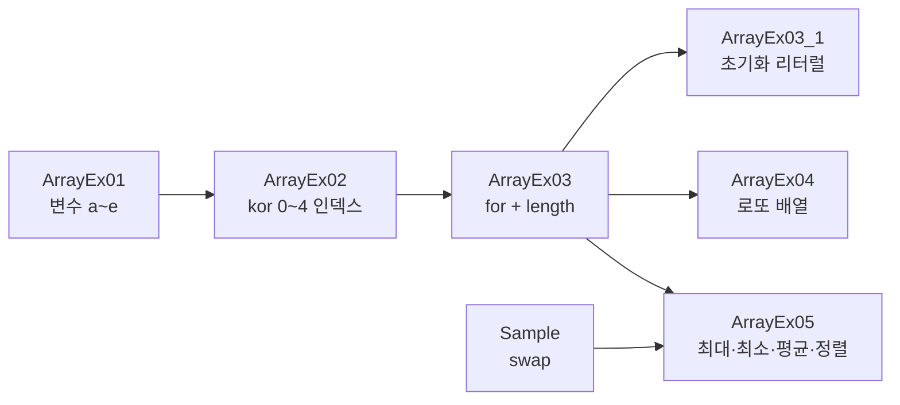

# Java20260514-배열 — 배열 · 최대/최소 · 평균 · 정렬

> 📅 2026-05-14 | 🧭 [전체 로드맵으로](../README.md) | ◀ 이전: [제어문](../Java20260513-제어문/README.md) | ▶ 다음: [함수](../Java20260515-함수/README.md)

"학생 5명의 점수"처럼 **같은 종류의 값 여러 개**를 변수 5개로 관리하던 방식에서,
**배열 하나 + 반복문**으로 관리하는 방식으로 넘어가는 과정을 단계별로 보여 줍니다.
마지막에는 배열로 **최대값·최소값·합계·평균·정렬**까지 구현합니다.

---

## 1. 이 프로젝트에서 배우는 것

- 배열이 필요한 이유 (변수 나열의 한계)
- 배열 선언/생성: `int[] kor = new int[5];`
- 인덱스는 **0부터** 시작, 마지막 인덱스는 `length - 1`
- `배열.length` 와 `for`문으로 전체 순회
- 배열 초기화 리터럴: `int[] kor = {90, 60, 77, 33, 78};`
- 두 변수 값 교환(**swap**) — `temp` 변수 사용
- 최대/최소 찾기, 합계/평균 계산
- **버블 정렬**(오름차순)

## 2. 폴더 구조

```
Java20260514-배열/src/ex01/
├── ArrayEx01.java    변수 5개 (배열 없이)
├── ArrayEx02.java    배열 + 인덱스 직접 사용
├── ArrayEx03.java    배열 + for 문
├── ArrayEx03_1.java  배열 초기화 리터럴 { }
├── ArrayEx04.java    로또 번호 6개 (난수 배열)
├── ArrayEx05.java    최대·최소·총점·평균·정렬 종합
└── Sample.java       두 변수 값 교환 (swap)
```

## 3. 학습 흐름



> `Sample.java`의 **swap** 은 `ArrayEx05` 정렬 단계에서 그대로 쓰이는 준비 운동입니다.

---

## 4. 예제별 상세

### ArrayEx01 · 배열 없이 변수 5개
```java
int a = (int)(Math.random()*100) + 1;   // 1~100
int b = ...; int c = ...; int d = ...; int e = ...;
System.out.println("1번째 학생 : " + a);
...
```
학생이 100명이면 변수 100개, 출력문 100줄이 필요합니다. → **배열이 필요한 이유**

### ArrayEx02 · 배열 도입
```java
int[] kor = new int[5];      // int 5칸, 모두 0으로 자동 초기화
kor[0] = (int)(Math.random()*100) + 1;
...
kor[4] = ...;
```
```
 인덱스:  [0] [1] [2] [3] [4]
 kor   :  95  12  72  48  37
```
변수는 하나가 되었지만, 아직 인덱스를 직접 써서 코드 줄 수는 같습니다.

### ArrayEx03 · 배열 + for 문 ⭐
```java
int[] kor = new int[5];
for (int i = 0; i < kor.length; i++)
    kor[i] = (int)(Math.random()*100) + 1;

for (int i = 0; i < kor.length; i++)
    System.out.println((i + 1) + "번째 학생 : " + kor[i]);
```
**인덱스를 변수 `i`로 바꾸는 순간**, 학생 수가 몇 명이든 코드는 그대로입니다. `kor.length`를 쓰면 배열 크기를 바꿔도 반복문을 고칠 필요가 없습니다.

### ArrayEx03_1 · 배열 초기화 리터럴
```java
int[] kor = {90, 60, 77, 33, 78};    // 선언 + 생성 + 값 대입을 한 번에
```
**실행 결과**
```
1번째 학생 : 90
2번째 학생 : 60
3번째 학생 : 77
4번째 학생 : 33
5번째 학생 : 78
```

### ArrayEx04 · 로또 번호
```java
int[] lotto = new int[6];
for (int i = 0; i < lotto.length; i++)
    lotto[i] = (int)(Math.random()*45) + 1;   // 1~45

for (int i = 0; i < lotto.length; i++)
    System.out.print(lotto[i] + " ");        // print: 줄바꿈 없음
System.out.println("\n이 문장 출력");           // \n : 줄바꿈 문자
```
`print` vs `println`, 그리고 `\n` 의 차이를 확인합니다.

### Sample · 두 변수 값 교환 (swap)
```java
int num1 = 100, num2 = 200;
int temp = num1;   // ① num1 값을 임시 보관
num1 = num2;       // ② num1 ← num2
num2 = temp;       // ③ num2 ← 보관해 둔 값
```
```
before >>
num1 = 100 , num2 = 200
after >>
num1 = 200 , num2 = 100
```
`num1 = num2; num2 = num1;` 처럼 바로 대입하면 원래 값이 사라지므로 **`temp`가 꼭 필요**합니다.

### ArrayEx05 · 종합: 최대·최소·총점·평균·정렬 ⭐
```java
int[] number = new int[10];
for (int i = 0; i < number.length; i++)
    number[i] = (int)(Math.random()*100) + 1;
```

**① 최대값 / 최소값**
```java
int max = number[0];       // ⭐ 0이 아니라 첫 번째 원소로 초기화
int min = number[0];
for (int i = 0; i < number.length; i++) {
    if (max < number[i]) max = number[i];
    if (min > number[i]) min = number[i];
}
```
> `int max = 0;` 은 주석 처리되어 있습니다. 모든 값이 음수라면 0이 최대값으로 잘못 나오고,
> `min = 0`이면 최소값이 항상 0이 됩니다. **첫 번째 원소로 초기화**하는 것이 정석입니다.

**② 총점 / 평균**
```java
int sum = 0;
for (int i = 0; i < number.length; i++) sum += number[i];
double avg = (double) sum / number.length;   // 정수 나눗셈 방지
```

**③ 버블 정렬 (오름차순)**
```java
for (int i = 0; i < number.length; i++) {
    for (int j = 0; j < number.length - 1; j++) {   // j+1 이 범위를 넘지 않도록 -1
        if (number[j] > number[j + 1]) {             // 앞이 더 크면
            int temp = number[j];                    // Sample.java 의 swap
            number[j] = number[j + 1];
            number[j + 1] = temp;
        }
    }
}
```
이웃한 두 값을 비교해 큰 값을 뒤로 보내는 과정을 반복하면, 한 바퀴마다 가장 큰 값이 맨 뒤에 "거품처럼" 자리 잡습니다.

**실행 예** (난수이므로 매번 다름)
```
값 저장 >
24 56 82 25 37 15 46 42 46 1
최대값 : 82
최소값 : 1
총점 : 374
평균 : 37.4

1 15 24 25 37 42 46 46 56 82
```

---

## 5. 핵심 개념 정리

| 개념 | 코드 | 비고 |
|---|---|---|
| 선언 + 생성 | `int[] a = new int[5];` | 기본값: 정수 `0`, 실수 `0.0`, 객체 `null` |
| 초기화 리터럴 | `int[] a = {1, 2, 3};` | 크기는 값 개수로 결정 |
| 접근 | `a[0]`, `a[i]` | 0 ~ `length-1` |
| 길이 | `a.length` | 메소드가 아닌 **필드** (괄호 없음) |
| 순회 | `for (int i = 0; i < a.length; i++)` | |
| swap | `temp = x; x = y; y = temp;` | |

## 6. 주의할 점

- `a[a.length]` 처럼 범위를 벗어나면 `ArrayIndexOutOfBoundsException` 이 발생합니다. 정렬의 안쪽 반복이 `length - 1` 인 이유입니다.
- **ArrayEx04 로또**는 같은 번호가 **중복으로 뽑힐 수 있습니다.** 중복 제거 버전은
  [예외처리 프로젝트의 `LottoProgram`(배열 + 중복검사)과 `LottoSetProgram`(Set 사용)](../Java20260522-예외처리/README.md)에서 다룹니다.
- 버블 정렬은 바깥 반복을 `length - 1`번, 안쪽 반복을 `length - 1 - i`번으로 줄일 수 있습니다(최적화). 실무에서는 `Arrays.sort(number);` 를 사용합니다.

## 7. 연결

- ▶ 다음 단계: [함수](../Java20260515-함수/README.md) — 반복되는 코드를 **이름 붙은 블록**으로 묶습니다.
- 배열에는 기본형뿐 아니라 **객체**도 담을 수 있습니다 → [상속 ex08 `Product[]`, ex09 `Student[]`](../Java20260519-상속/README.md)
- 크기가 고정된 배열의 한계는 [제네릭/컬렉션 `List`](../Java20260522-제네릭/README.md)로 해결합니다.
