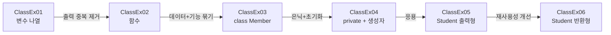

# Java20260515-클래스 — 클래스 입문 (변수 나열 → 함수 → 클래스)

> 📅 2026-05-15 | 🧭 [전체 로드맵으로](../README.md) | ◀ 이전: [함수](../Java20260515-함수/README.md) | ▶ 다음: [클래스 심화 0518](../Java20260518-클래스/README.md)

"학생 정보 관리" 하나의 주제를 **4단계로 리팩터링**하며 클래스가 왜 필요한지 체감하는 프로젝트입니다.
이어서 "성적 처리" 예제로 클래스 안의 **메소드(기능)** 설계를 연습합니다.

---

## 1. 이 프로젝트에서 배우는 것

- 클래스 = **멤버 변수(데이터) + 메소드(기능)** 의 묶음
- `new`로 객체(인스턴스) 생성, `.`(점)으로 멤버 접근
- 한 파일에 여러 클래스 작성 (`public class`는 파일당 1개)
- **생성자**로 객체 생성과 동시에 초기화
- 기본 생성자와 매개변수 생성자 (생성자 오버로딩의 시작)
- `private`로 멤버 변수 숨기기 (정보 은닉)
- `printf` 형식 출력 (`%d`, `%.2f`)
- 출력형 메소드 → **반환형 메소드** 로 개선, Getter 맛보기

## 2. 폴더 구조

```
Java20260515-클래스/src/
├── ex01/
│   ├── ClassEx01.java   변수 12개로 4명 관리
│   ├── ClassEx02.java   출력을 함수 memberInfo()로 분리
│   └── ClassEx03.java   class Member 도입 (필드 직접 대입)
├── ex02/ClassEx04.java  private 필드 + 생성자
├── ex03/ClassEx05.java  Student 성적 처리 (메소드가 직접 출력)
└── ex04/ClassEx06.java  Student 성적 처리 (메소드가 값을 반환) + getName()
```

## 3. 학습 흐름



---

## 4. 예제별 상세

### ClassEx01 · 변수만으로 관리 (문제 상황)
```java
String name1 = "홍길동"; int age1 = 20; String phone1 = "010-1111-2222";
String name2 = "이순신"; int age2 = 30; String phone2 = "010-2222-3333";
String name3 = "유관순"; int age3 = 18; String phone3 = "010-4444-5555";
String name4 = "까미";   int age4 = 6;  String phone4 = "010-9999-5555";
System.out.println("이름 : " + name1); ... (12줄 출력)
```
- 사람 1명 = 변수 3개 → **사람이 늘수록 변수가 폭발**
- `name1`과 `age1`이 "같은 사람"이라는 사실을 **이름 규칙으로만** 알 수 있음

### ClassEx02 · 출력 부분을 함수로
```java
memberInfo(name1, age1, phone1);
memberInfo(name2, age2, phone2);

static void memberInfo(String name, int age, String phone) {
    System.out.println("이름 : " + name);
    System.out.println("나이 : " + age);
    System.out.println("전화번호 : " + phone);
}
```
출력 중복은 사라졌지만, **데이터는 여전히 흩어져** 있고 매번 3개를 따로 넘겨야 합니다.

### ClassEx03 · 클래스 도입 ⭐
```java
class Member {               // 설계도
    String name;             // 멤버 변수 (필드)
    int age;
    String phone;

    void memberInfo() {      // 메소드 — 자기 필드를 바로 사용
        System.out.println("이름 : " + name);
        ...
    }
}

Member hong = new Member();  // 객체(인스턴스) 생성
hong.name  = "홍길동";
hong.age   = 20;
hong.phone = "010-1111-2222";
hong.memberInfo();           // 매개변수 없이 호출!
```
```
   설계도 (class Member)         메모리 위 객체들
 ┌──────────────────────┐      hong ─▶ [name:"홍길동", age:20, phone:"010-1111-2222"]
 │ name, age, phone     │      lee  ─▶ [name:"이순신", age:30, phone:"010-2222-3333"]
 │ memberInfo()         │
 └──────────────────────┘
```
- 이름·나이·전화가 **하나의 객체로 묶였고**, 메소드가 자기 데이터를 알고 있어 인자를 넘길 필요가 없습니다.
- 한 `.java` 파일에 클래스를 여러 개 둘 수 있지만, `public class`는 **파일 이름과 같은 하나**만 가능합니다.

### ClassEx04 · private + 생성자
```java
class Member {
    private String name;      // 외부에서 hong.name 접근 불가
    private int age;
    private String phone;

    public Member() { }       // 기본 생성자

    // 생성자: 클래스 이름과 같고 반환타입이 없음 → 멤버 변수 초기화 용도
    public Member(String n, int a, String p) {
        name = n; age = a; phone = p;
    }
    void memberInfo() { ... }
}

Member hong = new Member("홍길동", 20, "010-1111-2222");  // 생성 + 초기화 한 번에
Member kim  = new Member();                               // 기본 생성자
```
**실행 결과**
```
이름 : 홍길동
나이 : 20
전화번호 : 010-1111-2222
이름 : 이순신
나이 : 20
전화번호 : 010-2222-3333
이름 : null      ← 기본 생성자로 만든 kim: 초기화 안 된 필드의 기본값
나이 : 0
전화번호 : null
```
> 참조형(`String`) 필드의 기본값은 `null`, `int`는 `0` 입니다.

### ClassEx05 · 성적 처리 — 메소드가 직접 출력
```java
class Student {
    String name; int kor, eng, math;
    public Student(String n, int k, int e, int m) { ... }

    void total() {
        int sum = kor + eng + math;
        System.out.printf("총점 : %d\n", sum);
    }
    void avg() {
        double average = (kor + eng + math) / 3.0;   // 3.0 → 실수 나눗셈
        System.out.printf("평균 : %.2f\n", average); // 소수 둘째 자리
    }
}
```
```
홍길동:
총점 : 256
평균 : 85.33
이순신:
총점 : 146
평균 : 48.67
```

### ClassEx06 · 성적 처리 — 메소드가 값을 반환 ⭐
```java
class Student {
    private String name; private int kor, eng, math;   // 모두 private

    String getName() { return name; }   // private 필드를 읽기 위한 통로 (Getter)
    int    total()   { return kor + eng + math; }
    double avg()     { return total() / 3.0; }   // ⭐ 다른 메소드 재사용
}

System.out.println("총점 : " + st1.total());
System.out.println("평균 : " + st1.avg());
```
**ClassEx05 → ClassEx06 의 개선점**
| | ClassEx05 | ClassEx06 |
|---|---|---|
| 필드 | 공개 (`st1.name`) | `private` + `getName()` |
| `total()` | 출력만 하고 끝 (`void`) | **값 반환** (`int`) |
| `avg()` | 합계를 다시 계산 | `total()` **재사용** |
| 활용 | 화면 출력 외에는 쓸 수 없음 | 비교·저장·다른 계산에 재사용 가능 |

```
이순신:
총점 : 223
평균 : 74.33333333333333     ← 형식 지정 없이 double 그대로 출력
```

---

## 5. 핵심 개념 정리

| 용어 | 의미 |
|---|---|
| 클래스 | 객체를 만들기 위한 **설계도** |
| 객체 / 인스턴스 | `new`로 메모리에 만들어진 **실체** |
| 멤버 변수 (필드) | 객체가 가지는 데이터 |
| 메소드 | 객체가 하는 동작 |
| 생성자 | `new` 할 때 자동 호출, **필드 초기화** 담당. 이름 = 클래스명, 반환타입 없음 |
| `private` | 클래스 내부에서만 접근 가능 → 정보 은닉 |
| `printf` | `%d` 정수, `%f` 실수, `%.2f` 소수 둘째 자리, `%s` 문자열, `\n` 줄바꿈 |

## 6. 주의할 점

- 같은 패키지에 같은 이름의 클래스는 둘 수 없어 `Member`(ex01, ex02), `Student`(ex03, ex04)를 **패키지로 분리**했습니다.
- `ClassEx04`의 생성자 매개변수 이름이 `n, a, p` 인 이유: 필드명과 같은 `name`을 쓰면 `name = name;` 이 되어 구분이 안 됩니다. 이 문제는 다음 날 **`this.name = name;`** 으로 해결합니다.
- `ClassEx01`의 4번째 사람(`까미`) 앞에는 구분선이 빠져 있습니다 (출력 형식만의 차이).

## 7. 연결

- ▶ 다음 단계: [클래스 심화 0518](../Java20260518-클래스/README.md) — 은행 계좌 예제로 **캡슐화 · Getter/Setter · 생성자 오버로딩 · `this` · `static`** 을 완성합니다.
