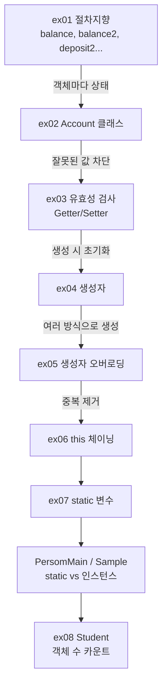

# Java20260518-클래스 — 객체지향 심화 (캡슐화 · 생성자 · this · static)

> 📅 2026-05-18 | 🧭 [전체 로드맵으로](../README.md) | ◀ 이전: [클래스 입문](../Java20260515-클래스/README.md) | ▶ 다음: [상속](../Java20260519-상속/README.md)

**은행 계좌(Account)** 하나를 `ex01 → ex07`까지 7번 고쳐 가며 객체지향의 핵심 문법을 완성합니다.
마지막으로 `static`(클래스 변수/메소드)과 인스턴스 멤버의 차이를 `Person`, `Student` 예제로 정리합니다.

---

## 1. 이 프로젝트에서 배우는 것

- **절차지향 vs 객체지향** 비교
- **정보 은닉(캡슐화)**: `private` 필드 + 메소드를 통한 접근
- **유효성 검사**: 잘못된 입금·출금 막기
- **Getter / Setter** 작성 규칙
- **생성자**: 디폴트 생성자 규칙, 생성자 오버로딩
- **`this`** 의 두 가지 용도: ① 객체 자신 `this.필드` ② 다른 생성자 호출 `this(...)`
- **`static`**: 인스턴스 변수 vs 클래스(정적) 변수, 인스턴스 메소드 vs 정적 메소드
- 지역 변수 / 멤버 변수 / 클래스 변수의 구분

## 2. 폴더 구조

```
Java20260518-클래스/src/
├── ex01/ProceduralEx.java  절차지향: static 변수·함수로 계좌 2개
├── ex02/AccountMain.java   Account 클래스 (객체지향 전환)
├── ex03/AccountMain.java   유효성 검사 + Getter/Setter
├── ex04/AccountMain.java   생성자 (기본 / 잔고 지정)
├── ex05/AccountMain.java   생성자 오버로딩 3개 + name 필드
├── ex06/AccountMain.java   this(...) 생성자 체이닝
├── ex07/
│   ├── AccountMain.java    static 클래스 변수 추가 (max)
│   ├── PersomMain.java     인스턴스 vs static 변수·메소드
│   └── Sample.java         지역 변수, static/인스턴스 메소드 호출 방법
└── ex08/
    ├── Main.java           학생 수 세기 실행
    └── Student.java        static studentCount (별도 파일 클래스)
```

## 3. 학습 흐름



---

## 4. 예제별 상세

### ex01 · `ProceduralEx` — 절차지향 방식의 한계
```java
static int balance = 0;                    // 홍길동 잔고
static void deposit(int amount)  { balance += amount; }
static void withdraw(int amount) { balance -= amount; }

static int balance2 = 0;                   // 이순신 잔고 → 사람마다 복사!
static void deposit2(int amount)  { balance2 += amount; }
static void withdraw2(int amount) { balance2 -= amount; }
```
고객이 100명이면 `balance100`, `deposit100` … 이 필요합니다. **데이터와 기능이 사람 단위로 묶이지 않는 것**이 문제입니다.
```
홍길동 현재 잔고 : 3000
이순신 현재 잔고: 7000
```

### ex02 · `Account` 클래스 — 객체지향으로 전환
```java
class Account {
    private int balance = 0;
    int  getBalance()           { return balance; }
    void deposit(int amount)    { balance += amount; }
    void withdraw(int amount)   { balance -= amount; }
}

Account lee  = new Account();  lee.deposit(15000);  lee.withdraw(8000);
Account hong = new Account();  hong.deposit(10000); hong.withdraw(7000);
```
클래스는 **하나**인데, 객체마다 **자기 `balance`** 를 따로 가집니다. 고객이 늘어도 `new Account()` 만 하면 됩니다.

### ex03 · 유효성 검사 + Getter / Setter
```java
void deposit(int amount) {
    if (amount > 0) balance += amount;
    else System.out.println("마이너스는 입금 불가");
}
void withdraw(int amount) {
    if (amount > balance) System.out.println("잔고부족 인출불가");
    else balance -= amount;
}
```
`private`이기 때문에 `lee.balance = -100000;` 은 **컴파일 에러**(주석 처리됨). 잔고는 반드시 `deposit/withdraw`를 거쳐야 하므로 **잘못된 값이 들어올 길이 막힙니다.** → 이것이 캡슐화의 목적입니다.

```
이순신 거래 내역
마이너스는 입금 불가      ← deposit(-15000) 차단
잔고부족 인출불가         ← 잔고 0 에서 withdraw(8000) 차단
이순신 현재 잔고: 0
```

**Getter / Setter 작성 규칙 (코드 주석 정리)**
| | Getter | Setter |
|---|---|---|
| 용도 | 필드 값 **읽기** | 필드 값 **쓰기** |
| 반환타입 | 필드의 자료형 | `void` |
| 이름 | `get` + 필드명(첫 글자 대문자) → `getBalance` | `set` + 필드명 → `setBalance` |
| 매개변수 | 없음 | 필드 자료형 1개 |

> Eclipse: `Source > Generate Getters and Setters...` (단축키 `Alt + Shift + S`, `R`)

### ex04 · 생성자
```java
class Account {
    private int balance;
    public Account() { }                         // 기본 생성자
    public Account(int balance) {                // 잔고를 지정하며 생성
        this.balance = balance;                  // this.필드 = 매개변수
    }
}
Account lee  = new Account(3000);
Account hong = new Account();
```
**생성자 규칙 (코드 주석 정리)**
1. 객체를 생성하면 **반드시** 생성자가 호출된다.
2. 이름 = 클래스명, **반환타입 없음**.
3. 용도는 **멤버 변수 초기화**.
4. 생성자를 하나도 안 만들면 자바가 **디폴트 생성자**를 자동으로 만들어 준다.
5. ⚠ 하나라도 직접 만들면 디폴트 생성자는 **만들어 주지 않는다** → `new Account()`를 쓰려면 직접 작성해야 함.

```
이순신 현재 잔고: 3000   ← 3000으로 시작, -15000 입금 거부, 8000 출금 거부
홍길동 현재 잔고: 3000   ← 0 + 10000 - 7000
```

### ex05 · 생성자 오버로딩 + `this.필드`
```java
class Account {
    private int balance;
    private String name;

    Account()                         { this.name = "익명"; this.balance = 0; }
    Account(int balance)              { this.balance = balance; this.name = "익명"; }
    Account(String name, int balance) { this.name = name; this.balance = balance; }
}
Account kim  = new Account();               // 익명, 0
Account park = new Account(1000);           // 익명, 1000
Account su   = new Account("유관순", 3000);  // 유관순, 3000
```
`this.name = name;` — 왼쪽 `this.name`은 **객체의 필드**, 오른쪽 `name`은 **매개변수**입니다. 어제(`ClassEx04`)의 `name = n;` 같은 어색한 이름 짓기를 해결합니다.

### ex06 · `this(...)` 생성자 체이닝 ⭐
```java
Account()            { this("익명", 0); }        // 다른 생성자에게 위임
Account(int balance) { this("익명", balance); }
Account(String name, int balance) {             // 실제 초기화는 여기 한 곳만
    this.name = name;
    this.balance = balance;
}
```
- 초기화 로직이 **한 곳**에만 있어 수정이 쉬워집니다.
- `this(...)`는 생성자의 **첫 줄**에만 쓸 수 있습니다.

**`this`의 두 가지 용도**
| 형태 | 의미 |
|---|---|
| `this.필드` | 현재 객체 자신의 멤버 (매개변수와 이름이 같을 때 구분) |
| `this(...)` | 같은 클래스의 **다른 생성자** 호출 |

ex05·ex06·ex07 실행 결과 (동일)
```
이순신 거래 내역
마이너스는 입금 불가
잔고부족 인출불가
이순신님 현재 잔고: 3000
------------------------------
홍길동 잔고 통장 입출금 내역
홍길동님 현재 잔고: 6000      ← 3000 + 10000 - 7000
```

### ex07 · `static` — 클래스 변수와 정적 메소드

**AccountMain** — `static int max = 100;` 클래스 변수를 추가 (모든 계좌가 공유하는 값).

**PersomMain** ⭐
```java
class Person {
    String name;                   // 인스턴스 변수 — 객체마다 따로
    int age;
    static double pi = 3.14159;    // 클래스 변수 — 모든 객체가 하나를 공유
    static int no = 0;

    Person(String name, int age) { this.name = name; this.age = age; no++; }

    void func()         { age = age + 1; no = no + 1; }  // 인스턴스 메소드: 둘 다 접근 가능
    static void func2() { no = no + 1; /* age = age + 1; ❌ */ }  // static 메소드: 인스턴스 변수 접근 불가
}

new Person("까미", 15); new Person("로이", 13); new Person("강산", 5);
System.out.println("no : " + Person.no);   // ✅ 권장: 클래스명으로 접근
System.out.println("no : " + p1.no);       // 가능하지만 비권장 (같은 값)
```
```
까미
5
no : 3      ← 생성자가 3번 호출되어 no = 3, 어느 객체로 읽어도 같은 값
no : 3
no : 3
no : 3
func() 호출
func() 호출
func2() 호출
```
```
              static 영역 (클래스당 1개)
           ┌────────────────────────┐
           │ Person.no = 3          │ ◀── p1, p2, p3 모두 같은 곳을 봄
           │ Person.pi = 3.14159    │
           └────────────────────────┘
 heap:  p1[name:까미, age:15]  p2[name:로이, age:13]  p3[name:강산, age:5]
```

**Sample** — 호출 방법 정리
```java
func(100);                 // 같은 클래스의 static 메소드 → 바로 호출
Sample s1 = new Sample();  // 인스턴스 메소드 add() → 객체를 만들어야 호출 가능
s1.add();
Car c1 = new Car(); c1.func();   // 다른 클래스의 인스턴스 메소드
Bus.func2();                     // 다른 클래스의 static 메소드 → 클래스명.메소드()
System.out.println(Bus.bus1);    // static 변수 → 클래스명.변수
```

### ex08 · `Student` — static으로 생성된 객체 수 세기
```java
public class Student {          // 별도 파일(Student.java)로 분리된 public 클래스
    private String name;
    private int score;
    static int studentCount = 0;

    public Student() { }
    Student(String name, int score) {
        this.name = name; this.score = score;
        studentCount++;         // 학생이 생성될 때마다 증가
    }
}
```
```
이름 : 까미
점수 : 95

이름 : 로이
점수 : 85
전체 학생 수 : 3     ← s1~s3 만 카운트 (s4는 기본 생성자라 증가 안 함)
```

---

## 5. 핵심 개념 정리

| 구분 | 선언 위치 | 키워드 | 생성 시점 | 접근 방법 |
|---|---|---|---|---|
| 지역 변수 | 메소드 안 | — | 메소드 실행 시 | 메소드 안에서만 |
| 인스턴스 변수 | 클래스 안 | — | `new` 할 때 객체마다 | `객체.변수` |
| 클래스 변수 | 클래스 안 | `static` | 클래스 로딩 시 1개 | `클래스명.변수` |

| 메소드 | 호출 | 인스턴스 변수 사용 | static 변수 사용 |
|---|---|:---:|:---:|
| 인스턴스 메소드 | `객체.메소드()` | ✅ | ✅ |
| static 메소드 | `클래스명.메소드()` | ❌ | ✅ |

## 6. 주의할 점 (코드 점검 메모)

- **ex05~ex07**: 출력 제목은 "홍길동 잔고 통장 입출금 내역"이지만, 홍길동 계좌가 `new Account("홍길동", 3000)`으로 **3000원에서 시작**하므로 최종 잔고는 `6000`입니다 (ex02~ex04는 `3000`).
- **ex07/Sample.java**: `main` 안의 `int test = 10;`, `int var = 20;` 주석에 "인스턴스 변수, 멤버변수"라고 적혀 있지만, 메소드 안에서 선언했으므로 정확히는 **지역 변수**입니다.
- **ex07/PersomMain.java**: 파일/클래스 이름 `PersomMain`은 `PersonMain`의 오타입니다.
- **ex08**: `Student()` 기본 생성자는 `studentCount`를 증가시키지 않습니다. 모든 생성자에서 세려면 `public Student() { this(null, 0); }` 처럼 체이닝하면 됩니다.
- **ex08**: `showStudentCount()`는 static 변수만 사용하므로 `static` 메소드로 만들어 `Student.showStudentCount()`로 호출하는 것이 자연스럽습니다.

## 7. 연결

- ▶ 다음 단계: [상속](../Java20260519-상속/README.md) — 여러 클래스의 **공통 부분을 부모 클래스로** 뽑아냅니다. 생성자에서 배운 `this(...)`는 부모 생성자를 부르는 **`super(...)`** 로 이어집니다.
- `private static` 인스턴스 + `static` 메소드를 결합하면 **싱글톤** 패턴이 됩니다 → [상속 ex03](../Java20260519-상속/README.md)
