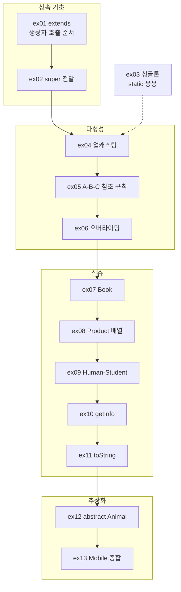
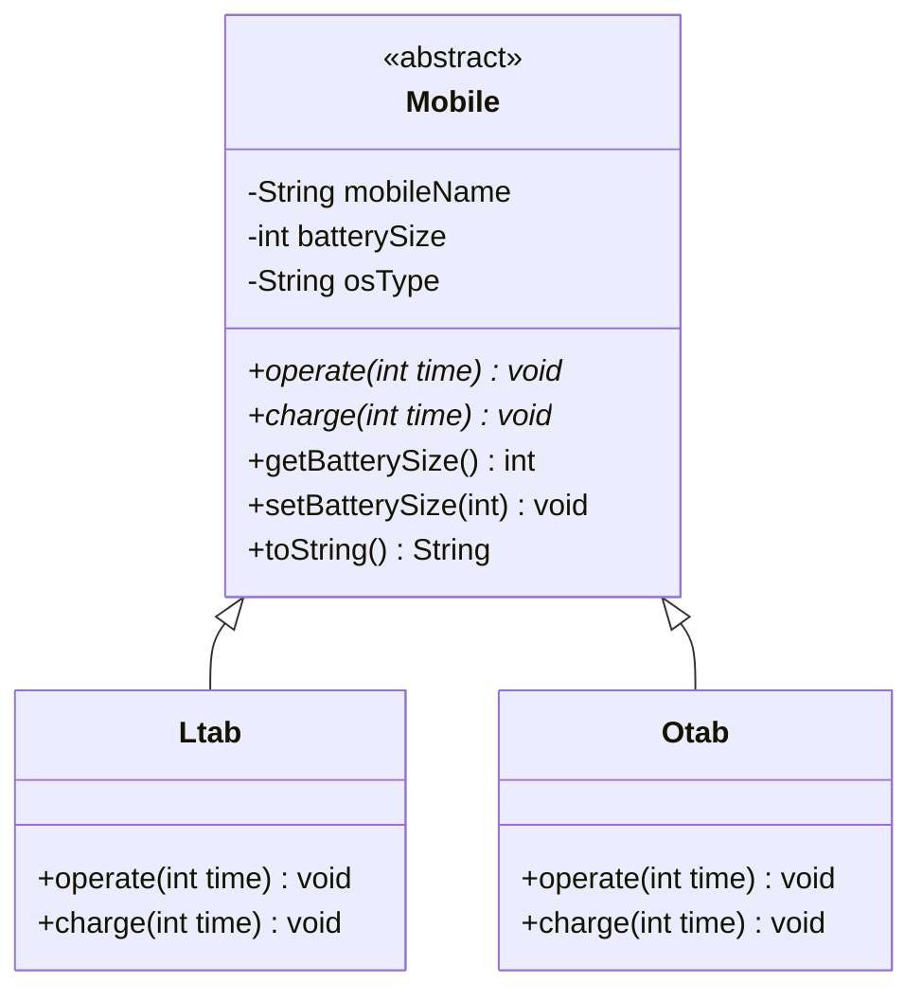

# Java20260519-상속 — 상속 · 다형성 · 오버라이딩 · 추상 클래스

> 📅 2026-05-19 | 🧭 [전체 로드맵으로](../README.md) | ◀ 이전: [클래스 심화](../Java20260518-클래스/README.md) | ▶ 다음: [인터페이스](../Java20260521-인터페이스/README.md)

객체지향의 핵심인 **상속**을 배우는 프로젝트로, 13개 패키지(가장 많음)로 구성됩니다.
`Animal ← Dog, Cat` 예제로 상속과 `super`를 익히고, `A ← B ← C` 예제로 **다형성과 오버라이딩**을 확인한 뒤,
`Book`, `Product`, `Student`, `Friend` 실습 문제와 **추상 클래스** `Mobile` 종합 문제로 마무리합니다.

---

## 1. 이 프로젝트에서 배우는 것

- `extends`로 상속하기, 상속받은 메소드 사용
- 자식 객체 생성 시 **부모 생성자가 먼저 호출**되는 규칙
- `super(...)`로 부모 생성자에 값 전달, `super.메소드()`로 부모 메소드 호출
- `private` 필드는 상속되어도 **직접 접근 불가** → `getName()` 같은 Getter 사용
- **업캐스팅**: `Animal a = new Dog();` (부모 타입 변수로 자식 객체 참조)
- 참조 가능/불가능한 타입 관계
- **메소드 오버라이딩**과 `@Override` 어노테이션, **동적 바인딩(다형성)**
- `Object.toString()` 오버라이딩
- **싱글톤 패턴** (`private` 생성자 + `static` 인스턴스)
- **추상 클래스 / 추상 메소드** (`abstract`)
- 객체 배열 (`Product[]`, `Student[]`, `Friend[]`)

## 2. 폴더 구조

```
Java20260519-상속/src/
├── ex01/ Animal, Dog, Cat, Main     상속 기본, 생성자 호출 순서
├── ex02/ Animal, Dog, Cat, Main     super(...) 로 부모에 값 전달
├── ex03/ Singleton, SingletonExam   싱글톤 패턴
├── ex04/ Animal, Dog, Cat, Main     업캐스팅 (부모 타입으로 참조)
├── ex05/ A, B, C, Main              A ← B ← C 다단계 상속, 참조 규칙
├── ex06/ A, B, C, Main              오버라이딩 + 다형성
├── ex07/ Book, BookTest             [실습] 생성자 오버로딩 + this(...)
├── ex08/ Product, ProductTest       [실습] 객체 배열
├── ex09/ Human, Student, StudentTest [실습] 상속 + super + 오버라이딩
├── ex10/ Person, Friend, FriendTest [실습] getInfo() (오버라이딩 미완)
├── ex11/ Person, Friend, FriendTest [실습] toString() 오버라이딩
├── ex12/ Animal, Dog, Cat, Main     추상 클래스
└── ex13/ Mobile, Ltab, Otab, MobileTest [종합] 추상 클래스 + 다형성
```

## 3. 학습 흐름



---

## 4. 예제별 상세

### ex01 · 상속 기본과 생성자 호출 순서
```java
public class Animal {
    public Animal() { System.out.println("애니멜 객체 생성"); }
    void eat()   { System.out.println(" 밥을 먹는다"); }
    void sleep() { System.out.println(" 잠을 잔다"); }
}
public class Dog extends Animal {
    public Dog() { System.out.println("Dog 객체 생성"); }   // 첫 줄에 super(); 가 숨어 있음
    void bark()  { System.out.println("가 멍멍 짓는다"); }
}
public class Cat extends Animal {
    public Cat() { }
    void meow()  { System.out.println("가 야옹 한다"); }
}
```
```java
Dog d = new Dog();  d.sleep(); d.eat(); d.bark();   // 부모 메소드 + 자기 메소드
Cat c = new Cat();  c.meow();  c.eat(); c.sleep();
```
**실행 결과**
```
애니멜 객체 생성     ← new Dog() 시 부모 생성자가 먼저!
Dog 객체 생성
 잠을 잔다
 밥을 먹는다
가 멍멍 짓는다
애니멜 객체 생성     ← new Cat() — Cat() 은 비어 있어도 부모 생성자는 호출됨
가 야옹 한다
 밥을 먹는다
 잠을 잔다
```
> 자식 생성자의 첫 줄에 `super()`를 쓰지 않으면, 컴파일러가 **`super();`를 자동으로 삽입**합니다.

### ex02 · `super(...)` 로 부모에게 값 전달
```java
public class Animal {
    private String name; private int age; private int height;
    String getName() { return name; }
    public Animal(String name) { this.name = name; }
    Animal(String name, int age, int height) { ... }
    void eat() { System.out.println(name + " 밥을 먹는다"); }
}
public class Dog extends Animal {
    Dog(String name, int age, int height) {
        super(name, age, height);     // 부모 생성자 호출 (첫 줄 필수)
    }
    void bark() { System.out.println(getName() + "가 멍멍 짓는다"); }
    //                               ↑ name 은 private → 직접 접근 불가, Getter 사용
}
public class Cat extends Animal {
    public Cat(String name) { super(name); }
}
```
```
로이 잠을 잔다
로이 밥을 먹는다
로이가 멍멍 짓는다
고양이가 야옹한다.
뽀양 밥을 먹는다
뽀양 잠을 잔다
```
> 이번에는 `"애니멜 객체 생성"`이 출력되지 않습니다. `super(name)`으로 **매개변수 있는 부모 생성자**를 지정했기 때문입니다.

### ex03 · 싱글톤 패턴
```java
public class Singleton {
    private static Singleton singleton = new Singleton();  // ① 클래스 로딩 시 단 1개 생성
    private Singleton() { }                                // ② 외부에서 new 금지
    public static Singleton getInstace() {                 // ③ 유일한 객체를 돌려주는 통로
        return singleton;
    }
}
Singleton s1 = Singleton.getInstace();
Singleton s2 = Singleton.getInstace();
```
```
ex03.Singleton@4517d9a3
ex03.Singleton@4517d9a3     ← 같은 주소 = 같은 객체
```
설정 정보, DB 연결 관리자처럼 **프로그램 전체에서 하나만 있어야 하는 객체**에 사용합니다. (전날 배운 `static`의 응용)

### ex04 · 업캐스팅 — 부모 타입으로 자식 참조
```java
Animal a1 = new Animal();
Animal a2 = new Dog();     // ✅ 부모 타입 변수 ← 자식 객체 (업캐스팅, 자동)
Animal a3 = new Cat();     // ✅
Dog    d1 = new Dog();
// Dog d2 = new Animal();  // ❌ 자식 타입 변수 ← 부모 객체
// Dog d3 = new Cat();     // ❌ 상속 관계가 아님
```
**규칙 (코드 주석 정리)**
- 상위 클래스 타입은 하위 클래스 객체를 **참조할 수 있다.**
- 하지만 상위 타입 변수로는 하위 클래스에만 있는 멤버(`bark()`)에 **접근할 수 없다.**
- 하위 클래스는 상위 클래스의 멤버에 **접근할 수 있다.**
- 하위 클래스 타입은 상위 클래스 객체를 **참조할 수 없다.**

```
애니멜 객체 생성                 ← a1
애니멜 객체 생성 / Dog 객체 생성  ← a2
애니멜 객체 생성                 ← a3
애니멜 객체 생성 / Dog 객체 생성  ← d1
```

### ex05 · `A ← B ← C` 다단계 상속과 참조 규칙
```java
class A { void fa() }
class B extends A { void fb() }
class C extends B { void fc() }

A a2 = new B();   // 사용 가능: fa()            ← 변수 타입(A)이 보이는 범위를 결정
A a3 = new C();   // 사용 가능: fa()
B b3 = new C();   // 사용 가능: fa(), fb()
C c3 = new C();   // 사용 가능: fa(), fb(), fc()
// B b1 = new A();  C c1 = new A();  C c2 = new B();   ❌
```
| 변수 타입 \ 객체 | `new A()` | `new B()` | `new C()` |
|---|:---:|:---:|:---:|
| `A` | ✅ | ✅ | ✅ |
| `B` | ❌ | ✅ | ✅ |
| `C` | ❌ | ❌ | ✅ |

### ex06 · 오버라이딩과 다형성 ⭐
```java
class A { void test() { System.out.println("A Class.."); } }
class B extends A {
    @Override                 // 부모 메소드를 재정의한다는 표시 (오타 시 컴파일 에러로 알려줌)
    void test() { System.out.println("B Class.."); }
}
class C extends B {
    @Override
    void test() { System.out.println("C Class.."); }
}

A a1 = new A();  a1.test();   // A Class..
A a2 = new B();  a2.test();   // B Class..  ← 변수는 A 타입이지만 실제 객체(B)의 메소드 실행
A a3 = new C();  a3.test();   // C Class..
B b2 = new B();  b2.test();   // B Class..
B b3 = new C();  b3.test();   // C Class..
```
> **다형성**: "어떤 메소드를 **호출할 수 있는지**는 변수 타입이, **어떤 메소드가 실행되는지**는 실제 객체가 결정한다."

| | 오버로딩 (Overloading) | 오버라이딩 (Overriding) |
|---|---|---|
| 배운 곳 | [함수 Ex08](../Java20260515-함수/README.md) | 여기 ex06 |
| 위치 | 같은 클래스 | 부모 ↔ 자식 클래스 |
| 이름 | 같음 | 같음 |
| 매개변수 | **달라야** 함 | **같아야** 함 |
| 목적 | 같은 이름으로 여러 입력 처리 | 부모 동작을 자식에 맞게 **재정의** |

### ex07 · [실습] Book — 생성자 오버로딩
> 문제: Book 객체 5개를 만들어 출력. 인자 없는 생성자는 "자바의 정석" 정보로 초기화.
```java
Book() { this("자바지의석", "남궁성", 45000); }    // this(...) 로 위임
Book(String title, String author, int price) { ... }
String getBookInfo() { return "제목 : " + title + ", 저자 : " + author + ", 가격: " + price; }
```
```
제목 : 파이썬 라이브러리, 저자 : 김영근, 가격: 39000
제목 : 빅데이타 기술, 저자 : 김강원, 가격: 30000
제목 : 혼공머신러닝, 저자 : 박해선, 가격: 32000
제목 : 데이터 엔지리어닝, 저자 : 김인범, 가격: 38000
제목 : 자바지의석, 저자 : 남궁성, 가격: 45000
```

### ex08 · [실습] Product — 객체 배열
```java
Product[] pArr = new Product[5];        // ⚠ 객체 5개가 아니라 "참조 5칸"(모두 null)이 생김
pArr[0] = new Product("짱구", 10, 1200); // 각 칸에 객체를 직접 생성해 넣어야 함
...
pArr[4] = new Product();                // 기본값: 듀크인형, 5, 1000
for (int i = 0; i < 5; i++)
    System.out.print(pArr[i].getName() + " " + pArr[i].getBalance() + " " + pArr[i].getPrice() + "원");
```
```
짱구 10 1200원
---------------------
...
듀크인형 5 1000원
```

### ex09 · [실습] Human ← Student — 상속 + super + 오버라이딩
```java
public class Human {
    private String name; private int age, height, weight;
    public String printInformation() { return name + '\t' + age + '\t' + height + '\t' + weight; }
}
public class Student extends Human {
    static String number;     // ⚠ static (아래 주의할 점 참고)
    static String major;
    public Student(String name, int age, int height, int weight, String number, String major) {
        super(name, age, height, weight);
        this.number = number; this.major = major;
    }
    @Override
    public String printInformation() {
        return super.printInformation() + '\t' + number + '\t' + major;  // 부모 결과 + 내 정보
    }
}
```
`super.printInformation()` — **부모의 구현을 재사용하고 확장**하는 오버라이딩의 정석 패턴입니다.

**실제 실행 결과**
```
홍길동	20	171	81	201103	컴공
고길동	21	181	72	201103	컴공    ← 학번·전공이 모두 마지막 학생 값!
박길동	22	175	65	201103	컴공
```

### ex10 → ex11 · [실습] Friend — `getInfo()` 에서 `toString()` 으로
```java
// ex10: Person.getInfo() 는 이름만 반환, Friend 의 오버라이딩은 주석 처리됨
System.out.println(arr[i].getInfo());   // 까미 / 로이 / 강산 ... (이름만)

// ex11: 모든 클래스의 조상 Object 의 toString() 을 오버라이딩
class Person { @Override public String toString() { return name; } }
class Friend extends Person {
    @Override public String toString() { return super.toString() + "\t" + phoneNum + "\t" + email; }
}
System.out.println(arr[i]);   // println 이 자동으로 toString() 을 호출
```
```
까미	010	test@test.com
로이	111	test2@test.com
강산	222	abc@test.com
뽀양	333	abc2@test.com
야옹	444	test3@test.com
```
> `toString()`을 오버라이딩하지 않으면 `ex03.Singleton@4517d9a3` 처럼 **클래스명@해시코드**가 출력됩니다.

### ex12 · 추상 클래스
```java
public abstract class Animal {          // 추상 메소드가 1개 이상 → 추상 클래스
    void eat() { System.out.println("동물이 밥을 먹는다"); }   // 일반 메소드 (공통 기능)
    abstract void sound();              // 추상 메소드: 몸체 없음 → 자식이 반드시 구현
}
public class Dog extends Animal { @Override void sound() { System.out.println("강아지가 멍멍한다."); } }
public class Cat extends Animal { @Override void sound() { System.out.println("고양이가 야옹한다."); } }
// new Animal();  ❌ 추상 클래스는 객체 생성 불가
```
```
동물이 밥을 먹는다
강아지가 멍멍한다.
동물이 밥을 먹는다
고양이가 야옹한다.
```
- **공통 기능(`eat`)은 물려주고, 반드시 달라야 하는 기능(`sound`)은 구현을 강제**하는 것이 추상 클래스의 역할입니다.

### ex13 · [종합] Mobile — 추상 클래스 + 다형성


| 클래스 | `operate` (통화 1분당) | `charge` (충전 1분당) |
|---|---|---|
| `Ltab` | 배터리 −10 | 배터리 +10 |
| `Otab` | 배터리 −12 | 배터리 +8 |

```java
Mobile m1 = new Ltab("Ltab", 500, "ABC-01");     // 부모 타입으로 참조 (업캐스팅)
Mobile m2 = new Otab("Otab", 1000, "XYZ-20");
m1.charge(10);  m2.charge(10);                   // 같은 호출, 다른 동작 (다형성)
m1.operate(5);  m2.operate(5);

public static void printMobile(Mobile mobile) {  // 매개변수도 부모 타입 → 어떤 Mobile 이든 OK
    System.out.println(mobile);                  // toString() 자동 호출
}
```
```java
// Ltab.operate — private 필드는 Getter/Setter 로 조작
int batter = getBatterySize();   // 500
batter -= time * 10;             // 500 - 5*10
setBatterySize(batter);
```
**실행 결과**
```
Mobile	 Battery	 OS
------------------------------------
Ltab	500		ABC-01
Otab	1000		XYZ-20

[10분 충전]
Mobile	 Battery	 OS
------------------------------------
Ltab	600		ABC-01      ← 500 + 10×10
Otab	1080		XYZ-20      ← 1000 + 10×8

[5분 통화]
Mobile	 Battery	 OS
------------------------------------
Ltab	550		ABC-01      ← 600 − 5×10
Otab	1020		XYZ-20      ← 1080 − 5×12
```

---

## 5. 핵심 개념 정리

| 개념 | 요약 |
|---|---|
| `extends` | 부모의 필드·메소드를 물려받음 (자바는 **단일 상속**) |
| 생성자 호출 순서 | 부모 생성자 → 자식 생성자 (`super()` 자동 삽입) |
| `super(...)` | 부모 생성자 호출, 자식 생성자 **첫 줄** |
| `super.메소드()` | 오버라이딩한 메소드 안에서 부모 버전 호출 |
| 업캐스팅 | `Parent p = new Child();` 자동 변환 |
| 오버라이딩 | 부모 메소드와 **이름·매개변수·반환타입 동일**하게 재정의, `@Override` 권장 |
| 다형성 | 같은 타입·같은 호출 → 실제 객체에 따라 다른 동작 |
| `toString()` | `Object`의 메소드. 오버라이딩하면 `println(obj)` 출력 형식을 바꿀 수 있음 |
| 추상 클래스 | `abstract`, 객체 생성 불가, 추상 메소드 구현 강제 |
| 싱글톤 | `private` 생성자 + `private static` 인스턴스 + `public static` getter |

## 6. 주의할 점 (코드 점검 메모)

- **ex09 `Student`** ⚠: `number`, `major`가 **`static`** 으로 선언되어 모든 학생이 하나의 값을 공유합니다. 그래서 마지막에 만든 박길동의 `201103 컴공`이 세 명 모두에게 출력됩니다. → `private String number; private String major;` 로 바꾸면 각자 값이 나옵니다. (어제 배운 static의 특성을 확인할 수 있는 좋은 반례)
- **ex10**: `Friend`의 `getInfo()` 오버라이딩이 주석 처리되어 있어 **이름만** 출력됩니다. ex11에서 `toString()` 방식으로 완성됩니다.
- **ex08**: 문제는 "가격 천 단위 `,` + `원`"이지만 콤마는 미구현입니다. → `String.format("%,d원", price)` 또는 `printf("%,d원", price)` → `1,200원`
- **ex03**: 메소드명 `getInstace`는 `getInstance`의 오타입니다.
- **ex07**: 기본 도서명 `"자바지의석"`은 `"자바의 정석"`의 오타입니다.
- **ex01**: `bark()`, `meow()` 출력이 `"가 멍멍 짓는다"`로 시작하는 이유는 아직 이름 필드가 없기 때문 — ex02에서 `getName()`으로 개선됩니다.

## 7. 연결

- ▶ 다음 단계: [인터페이스](../Java20260521-인터페이스/README.md) — 추상 클래스보다 더 순수한 **"규격"** 을 정의하고, 업캐스팅한 객체를 다시 **다운캐스팅**합니다.
- `toString()`을 오버라이딩한 것처럼 `equals()`, `hashCode()`를 오버라이딩하는 예는 [제네릭 ex05 `Person`](../Java20260522-제네릭/README.md)에 있습니다.
