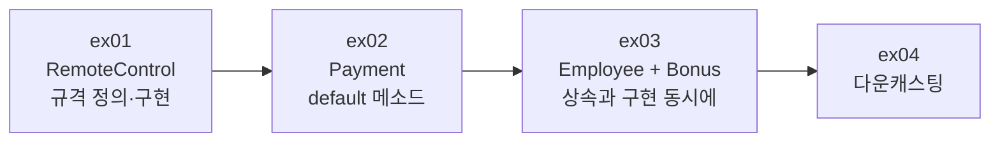
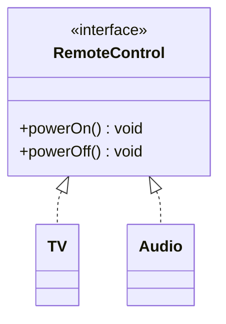
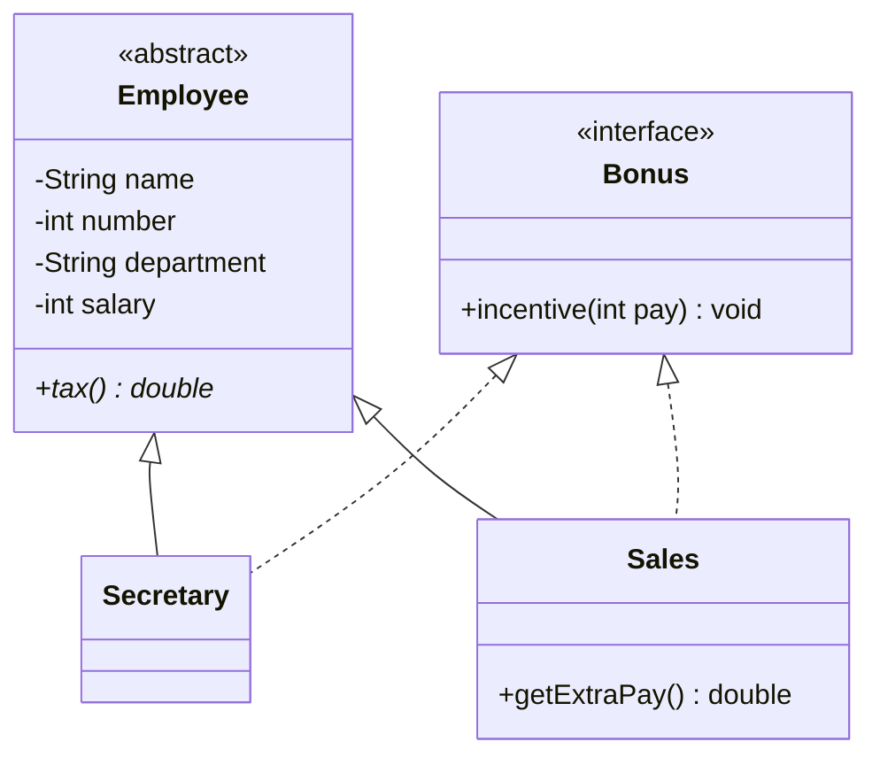

# Java20260521-인터페이스 — 인터페이스 · default 메소드 · 다운캐스팅

> 📅 2026-05-21 | 🧭 [전체 로드맵으로](../README.md) | ◀ 이전: [상속](../Java20260519-상속/README.md) | ▶ 다음: [제네릭](../Java20260522-제네릭/README.md)

**인터페이스**는 "이 기능을 반드시 제공하라"는 **규격(약속)** 입니다.
리모컨(`RemoteControl`)과 결제(`Payment`) 예제로 인터페이스와 `default` 메소드를 익히고,
**추상 클래스 + 인터페이스를 함께 쓰는** 회사 급여 예제, 업캐스팅한 객체를 되돌리는 **다운캐스팅**까지 다룹니다.

---

## 1. 이 프로젝트에서 배우는 것

- `interface` 선언과 `implements` 구현
- 인터페이스 메소드는 기본적으로 `public abstract` → 구현 클래스에서 `public` 필수
- 인터페이스 타입 변수로 구현 객체 참조 (다형성)
- **`default` 메소드** — 인터페이스에 기본 구현 제공, 필요하면 재정의
- `extends`(상속) + `implements`(구현) 동시 사용
- **다운캐스팅** `(B) a2` — 부모 타입으로 올렸던 객체를 다시 자식 타입으로

## 2. 폴더 구조

```
Java20260521-인터페이스/src/
├── ex01/ RemoteControl, TV, Audio, Main     인터페이스 기본
├── ex02/ Payment, CardPay, KakaoPay, NaverPay, Main   default 메소드
├── ex03/ Employee, Bonus, Secretary, Sales, Company   추상클래스 + 인터페이스 (실습)
└── ex04/ Main (A, B, C)                     업캐스팅 → 다운캐스팅
```

## 3. 학습 흐름



---

## 4. 예제별 상세

### ex01 · 리모컨 — 인터페이스 기본
```java
public interface RemoteControl {
    void powerOn();    // 추상 메소드 (public abstract 생략됨)
    void powerOff();
}
public class TV implements RemoteControl {
    @Override public void powerOn()  { System.out.println("TV 전원 ON"); }
    @Override public void powerOff() { System.out.println("TV 전원 OFF"); }
}
public class Audio implements RemoteControl {
    @Override public void powerOn()  { System.out.println("오디오 전원 ON"); }
    @Override public void powerOff() { System.out.println("오디오 전원 OFF"); }
}

RemoteControl r1 = new TV();      // 인터페이스 타입으로 참조
RemoteControl r2 = new Audio();
r1.powerOn(); r1.powerOff();
r2.powerOn(); r2.powerOff();
```
```
TV 전원 ON
TV 전원 OFF
오디오 전원 ON
오디오 전원 OFF
```

> 사용하는 쪽(`Main`)은 `RemoteControl`만 알면 됩니다. 기기가 TV든 오디오든 **같은 버튼(메소드)** 으로 조작합니다.

### ex02 · 결제 — `default` 메소드 ⭐
```java
public interface Payment {
    void pay(int money);                 // 반드시 구현

    default void coupon() {              // 기본 구현 제공 → 구현해도 되고 안 해도 됨
        System.out.println("할인기능은 각 구현체에서 개별적으로 하세요");
    }
}
public class CardPay  implements Payment { public void pay(int m) {...} }               // coupon 미구현
public class KakaoPay implements Payment { public void pay(int m) {...}
                                           public void coupon() { System.out.println("10% 할인 적용"); } }
public class NaverPay implements Payment { public void pay(int m) {...}
                                           public void coupon() { System.out.println("15% 할인 적용"); } }
```
```
카드로 50000원 결제
KakaoPay로 10000원 결제
10% 할인 적용
NaverPay로 20000원 결제
15% 할인 적용
```
> **default 메소드가 필요한 이유**: 이미 많은 클래스가 구현한 인터페이스에 새 기능(`coupon`)을 추가하면, 추상 메소드로는 **모든 구현 클래스가 컴파일 에러**가 납니다. `default`로 추가하면 기존 코드는 그대로 두고 필요한 클래스만 재정의할 수 있습니다.

### ex03 · [실습] 회사 급여 — 추상 클래스 + 인터페이스

```java
public class Sales extends Employee implements Bonus {   // 상속 1개 + 구현 n개
    public void incentive(int pay) { setSalary((int)(getSalary() + pay * 1.2)); } // 120%
    public double tax()            { return getSalary() * 0.13; }                // 13%
    public double getExtraPay()    { return getSalary() * 0.03; }                // 영업직 전용 3%
}
public class Secretary extends Employee implements Bonus {
    public void incentive(int pay) { setSalary((int)(getSalary() + pay * 0.8)); } // 80%
    public double tax()            { return getSalary() * 0.1; }                 // 10%
}
```
| 직군 | 인센티브 (`pay`의) | 세금 (`salary`의) | 추가 수당 |
|---|---|---|---|
| Secretary | 80% | 10% | — |
| Sales | 120% | 13% | 3% (`getExtraPay`) |

- `Employee`(추상 클래스) — "직원이라면 **가지는 것**(이름·급여)과 **반드시 하는 것**(`tax`)"
- `Bonus`(인터페이스) — "보너스를 받을 수 있는 **자격/능력**" (직원이 아닌 클래스에도 붙일 수 있음)

**현재 실행 결과** (세금 미출력 단계까지만 구현됨)
```
name	 department	 salary
--------------------------------------------
Duke	secretary	800
Tuxi	sales	1200
```

### ex04 · 업캐스팅 → 다운캐스팅
```java
A a2 = new B();     // 업캐스팅 (자동)
A a3 = new C();
a2.test();          // B class  (오버라이딩된 메소드 실행)
// a2.fb();         // ❌ A 타입으로는 fb() 가 안 보임

B b1 = (B) a2;      // 다운캐스팅 (명시적) — 실제 객체가 B 이므로 성공
b1.fb();            // ✅ 이제 B 의 메소드 사용 가능
C c1 = (C) a3;
c1.fc();
```
```
A class
B class
C class
B class
C class
```
> ⚠ 실제 객체가 그 타입이 아니면 `ClassCastException`이 발생합니다. 예: `C c = (C) a2;` (a2는 B 객체)
> 안전하게 하려면 `if (a2 instanceof B b) { b.fb(); }` 처럼 `instanceof`로 먼저 확인합니다.

---

## 5. 핵심 개념 정리

| | 추상 클래스 | 인터페이스 |
|---|---|---|
| 키워드 | `abstract class` / `extends` | `interface` / `implements` |
| 다중 | **단일** 상속만 | **여러 개** 구현 가능 |
| 필드 | 인스턴스 필드 가능 | 상수(`public static final`)만 |
| 메소드 | 일반 + 추상 | 추상 + `default` + `static` |
| 생성자 | 있음 | 없음 |
| 의미 | "~이다" (is-a) 공통 뼈대 | "~할 수 있다" (can-do) 규격 |
| 예 | `Employee`, `Animal`, `Mobile` | `RemoteControl`, `Payment`, `Bonus` |

| 형변환 | 방향 | 문법 | 실패 가능성 |
|---|---|---|---|
| 업캐스팅 | 자식 → 부모 | 자동 | 없음 |
| 다운캐스팅 | 부모 → 자식 | `(자식타입)` 명시 | `ClassCastException` |

## 6. 주의할 점 (코드 점검 메모)

- **ex03 `Company`는 미완성**입니다. 주석의 남은 단계:
  1. 모든 직원에게 인센티브 100 지급 → `for (Employee e : emp) ((Bonus) e).incentive(100);` (다운캐스팅 활용)
  2. `printEmployee(emp, true)` 호출 → `isTax` 블록에 `emp[i].tax()` 출력 구현
  - 예상 결과: Duke `800 + 80 = 880`, 세금 `88.0` / Tuxi `1200 + 120 = 1320`, 세금 `171.6`
- 인터페이스를 구현할 때 메소드에 `public`을 빼면 컴파일 에러입니다 (인터페이스 메소드는 `public`이므로 접근 범위를 좁힐 수 없음).

## 7. 연결

- ▶ 다음 단계: [제네릭](../Java20260522-제네릭/README.md) — `Object`로 받고 다운캐스팅하던 불편함을 **타입 파라미터 `<T>`** 로 해결합니다.
- 추상 메소드가 **딱 1개**인 인터페이스는 **람다**로 구현할 수 있습니다 → [익명객체/람다](../Java20260525_익명객체/README.md)
