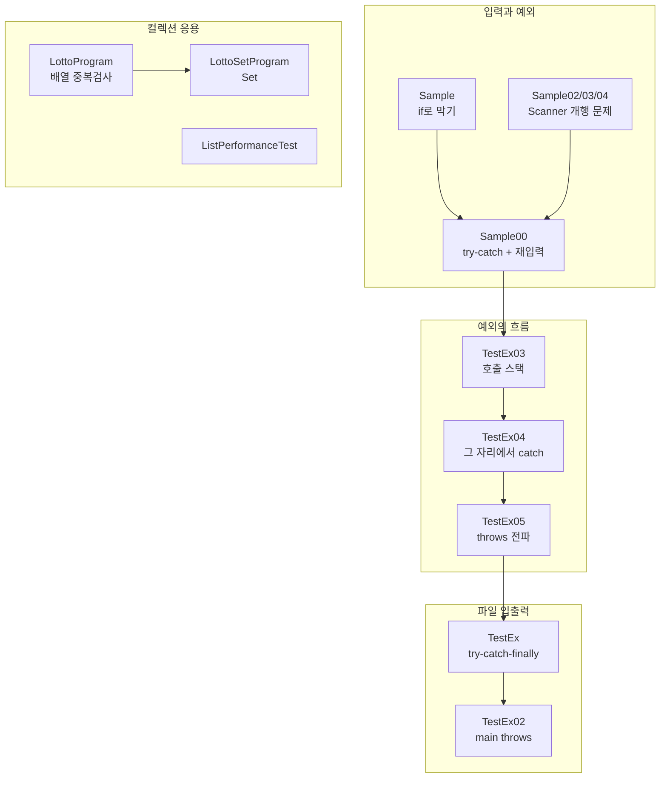
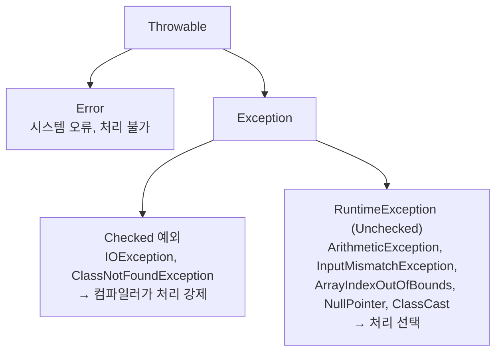

# Java20260522-예외처리 — 예외처리 · Scanner 입력 · 파일 읽기 · 컬렉션 응용

> 📅 2026-05-22 | 🧭 [전체 로드맵으로](../README.md) | ◀ 이전: [제네릭](../Java20260522-제네릭/README.md) | ▶ 다음: [익명객체/람다](../Java20260525_익명객체/README.md)

프로그램 실행 중 발생하는 오류(**예외**)를 다루는 방법을 배웁니다.
`if`로 막는 방식 → `try-catch`로 처리하는 방식, 예외가 메소드를 타고 **전파**되는 과정, `throws`로 **떠넘기기**,
그리고 `FileReader`로 파일을 읽으며 **checked 예외**를 경험합니다.
같은 날 배운 컬렉션을 응용한 **로또(중복 제거)**, **ArrayList vs LinkedList 성능 측정** 예제도 함께 들어 있습니다.

> 모든 파일이 `src/ex/` 한 패키지에 들어 있습니다.

---

## 1. 이 프로젝트에서 배우는 것

- 예외(Exception)란? — 컴파일은 되지만 **실행 중** 발생하는 오류
- `if`로 미리 막기 vs `try-catch`로 처리하기
- `Scanner`의 `nextInt()` / `nextLine()` 혼용 시 **엔터(개행) 문제**
- 잘못된 입력 후 버퍼 비우기 `sc.nextLine()`
- `try` / `catch` / `finally`
- **checked 예외**(`IOException`, `ClassNotFoundException`) — 처리하지 않으면 컴파일 에러
- `throws`로 호출한 쪽에 예외 처리 책임 넘기기
- 메소드 **호출 스택**과 예외 **전파**
- `e.printStackTrace()` 읽는 법
- `FileReader`로 텍스트 파일 읽기
- (컬렉션 응용) 로또 번호 중복 제거 — 배열 vs `Set`
- (컬렉션 응용) `ArrayList` vs `LinkedList` 성능 측정 (`System.nanoTime()`)

## 2. 폴더 구조

```
Java20260522-예외처리/src/ex/
├── Sample.java              if + while 로 0 나누기 방지 (예외처리 이전)
├── Sample00.java            try-catch 로 잘못된 입력 처리 + 재입력
├── Sample02.java            nextInt() 뒤 nextLine() 의 엔터 문제
├── Sample03.java            nextLine() 뒤 nextInt() (문제 없음)
├── Sample04.java            nextLine() 두 번
├── TestEx.java              FileReader + try-catch-finally
├── TestEx02.java            throws IOException (main 에서 떠넘김)
├── TestEx03.java            메소드 호출 순서 (예외 없음)
├── TestEx04.java            예외를 발생한 메소드 안에서 처리
├── TestEx05.java            throws 로 전파 → main 에서 처리
├── test.txt                 TestEx 가 읽는 파일 ("대한민국 좋은 나라")
├── LottoProgram.java        배열 + 중복 검사로 로또
├── LottoSetProgram.java     HashSet 으로 로또
└── ListPerformanceTest.java ArrayList vs LinkedList 성능 비교
```

## 3. 학습 흐름



---

## 4. 예제별 상세 — 입력과 예외

### Sample · `if` 로 0 나누기 막기 (예외처리 이전 방식)
```java
int num1 = sc.nextInt();
int num2 = sc.nextInt();
while (true) {
    if (num2 == 0) {
        System.out.println("분모는 0이 될수 없습니다.");
        System.out.println("다시 입력하세요");
        num2 = sc.nextInt();
    } else break;
}
System.out.println("나누기 결과: " + num1 / num2);
```
**실행 예** (입력 `10 0` → `5`)
```
두 정수 입력:
10 0
분모는 0이 될수 없습니다.
다시 입력하세요
5
나누기 결과: 2
프로그램 종료!
```
> 0은 막았지만, **문자(`abc`)를 입력하면** `InputMismatchException`으로 프로그램이 종료됩니다. 예상 가능한 모든 경우를 `if`로 막기는 어렵습니다.

### Sample00 · `try-catch` + 재입력 ⭐
```java
while (true) {
    try {
        num1 = sc.nextInt();
        num2 = sc.nextInt();
        int result = num1 / num2;          // 0 이면 ArithmeticException
        System.out.println("나누기 결과 : " + result);
        break;                             // 정상 실행 시에만 반복 종료
    } catch (Exception e) {                // 모든 예외를 잡음
        System.out.println("정수만 입력 가능합니다.");
        sc.nextLine();                     // ⭐ 잘못 입력된 값을 버퍼에서 제거
    }
}
sc.close();
```
- `sc.nextLine()`을 빼면 잘못된 입력(`abc`)이 버퍼에 남아 **무한 루프**에 빠집니다.

**실행 예** (입력 `abc` → `10 0` → `10 3`)
```
첫 번째 정수 입력 : abc
정수만 입력 가능합니다.
첫 번째 정수 입력 : 10
두 번째 정수 입력 : 0
정수만 입력 가능합니다.        ← ⚠ 실제로는 0으로 나눈 오류
첫 번째 정수 입력 : 10
두 번째 정수 입력 : 3
나누기 결과 : 3
프로그램 종료
```

### Sample02 / 03 / 04 · `Scanner` 개행 문제
| 파일 | 입력 순서 | 결과 |
|---|---|---|
| Sample02 | `nextInt()` → **`nextLine()`(버림)** → `nextLine()` | ✅ 정상 (엔터를 치워 줌) |
| Sample03 | `nextLine()` → `nextInt()` | ✅ 정상 |
| Sample04 | `nextLine()` → `nextLine()` | ✅ 정상 |

```java
// Sample02
int age = sc.nextInt();    // "20⏎" 중 20 만 읽고 ⏎ 는 버퍼에 남김
sc.nextLine();             // 남은 ⏎ 를 치움  ← 이 줄이 없으면 name 이 "" 가 됨
String name = sc.nextLine();
```
> `nextInt()`, `next()`, `nextDouble()`은 **개행 문자를 남기고**, `nextLine()`은 **개행까지 읽고 버립니다.**
> 숫자 입력 뒤에 문자열 한 줄을 읽을 때는 `nextLine()`을 한 번 더 호출해야 합니다.

---

## 5. 예제별 상세 — 예외의 흐름 (호출 스택과 전파)

### TestEx03 · 호출 스택 (예외 없음)
```java
main()    → method1() → method2()
             print "2"   print "3"
print "1"
```
```
3
2
1
```
메소드는 **스택**처럼 쌓였다가, 가장 마지막에 호출된 것부터 끝납니다.

### TestEx04 · 예외를 발생한 곳에서 처리
```java
static void method2() {
    try {
        Class.forName("java.lang.String2");   // 존재하지 않는 클래스 → ClassNotFoundException
    } catch (ClassNotFoundException e) {
        e.printStackTrace();                  // 예외 정보 + 호출 경로 출력
    }
    System.out.println("3");                  // 처리했으니 계속 진행
}
```
```
java.lang.ClassNotFoundException: java.lang.String2
	at ...
	at ex.TestEx04.method2(TestEx04.java:19)   ← 예외 발생 지점
	at ex.TestEx04.method1(TestEx04.java:13)
	at ex.TestEx04.main(TestEx04.java:8)       ← 시작 지점
3
2
1
```
> 스택 트레이스는 **위에서 아래로** "발생 지점 → 호출한 곳 → … → main" 순입니다. 내 코드 중 **가장 위의 줄**을 먼저 보세요.

### TestEx05 · `throws` 로 전파 ⭐
```java
public static void main(String[] args) {
    try { method1(); }
    catch (ClassNotFoundException e) { e.printStackTrace(); }   // 최종 처리
    System.out.println("1");
}
static void method1() throws ClassNotFoundException { method2(); System.out.println("2"); }
static void method2() throws ClassNotFoundException {
    Class.forName("java.lang.String2");    // 여기서 예외 발생
    System.out.println("3");               // 실행 안 됨
}
```
```
java.lang.ClassNotFoundException: java.lang.String2
	...
1          ← "3", "2" 는 출력되지 않음!
```
```
method2 (예외 발생, 처리 안 함) ──throws──▶ method1 (처리 안 함) ──throws──▶ main (catch)
   "3" 건너뜀                                  "2" 건너뜀                        "1" 출력
```

| | TestEx04 (그 자리에서 처리) | TestEx05 (throws 전파) |
|---|---|---|
| 처리 위치 | `method2` 내부 | `main` |
| 출력 | `3, 2, 1` | `1` |
| 의미 | 오류를 복구하고 계속 진행 | 오류 발생 시 **호출한 쪽이 판단** |

---

## 6. 예제별 상세 — 파일 읽기

### TestEx · `FileReader` + `try-catch-finally`
```java
try {
    FileReader fr = new FileReader("src/ex/test.txt");   // 파일이 없으면 FileNotFoundException
    int data;
    while ((data = fr.read()) != -1)      // 한 글자씩 읽고, 끝이면 -1
        System.out.print((char) data);
    fr.close();
    System.out.println("\n파일 읽기 완료");
} catch (IOException e) {                 // FileNotFoundException 의 부모
    System.out.println("파일이 없거나 읽는 중 오류 발생");
} finally {
    System.out.println("예외가 발생하든 안하든 필수적으로 실행해야될 코드 작성 공간");
}
```
```
대한민국 좋은 나라
파일 읽기 완료
예외가 발생하든 안하든 필수적으로 실행해야될 코드 작성 공간
```
- `FileReader`는 **checked 예외**(`IOException`)를 던지므로 `try-catch` 또는 `throws`가 **없으면 컴파일 에러**입니다.
- `finally`는 예외 여부와 관계없이 **항상 실행**됩니다 → 파일·DB 연결 닫기 등 정리 작업에 사용.
- 경로 `"src/ex/test.txt"`는 **프로젝트 폴더 기준 상대경로**입니다 (Eclipse 실행 시 작업 디렉터리 = 프로젝트 루트).

### TestEx02 · `main`에서 `throws`
```java
public static void main(String[] args) throws IOException {
    FileReader fr = new FileReader("src/ex/test.txt");
    fr.close();
}
```
처리를 JVM에게 넘깁니다. 파일이 있으면 아무것도 출력하지 않고, 없으면 스택 트레이스와 함께 프로그램이 종료됩니다.

---

## 7. 예제별 상세 — 컬렉션 응용

### LottoProgram · 배열 + 중복 검사
```java
for (int i = 0; i < lotto.length; i++) {
    int num = random.nextInt(45) + 1;      // Random 클래스: 0~44 → +1
    boolean duplicate = false;
    for (int j = 0; j < i; j++)            // 지금까지 뽑은 번호와 비교
        if (lotto[j] == num) { duplicate = true; break; }

    if (duplicate) i--;                    // ⭐ 중복이면 같은 자리 다시 뽑기
    else lotto[i] = num;
}
```
[배열 ArrayEx04](../Java20260514-배열/README.md)의 **중복 문제를 해결**한 버전입니다.

### LottoSetProgram · `HashSet` 으로 간단하게
```java
Set<Integer> lotto = new HashSet<>();
while (lotto.size() < 6)                   // 6개가 될 때까지
    lotto.add(random.nextInt(45) + 1);     // 중복은 Set 이 알아서 무시
```
중복 검사 코드 10줄이 **`Set` 한 줄**로 바뀝니다. (정렬해서 보려면 `TreeSet`)

### ListPerformanceTest · ArrayList vs LinkedList
30만 개를 넣은 뒤 각 연산의 시간을 `System.nanoTime()`으로 측정합니다.

| 연산 | 내용 | 측정 예: ArrayList | 측정 예: LinkedList | 빠른 쪽 |
|---|---|---|---|---|
| 조회 `get(i)` | 30만 번 | 약 1 ms | 약 34 초 | **ArrayList** |
| 수정 `set(i, v)` | 30만 번 | 약 5 ms | 약 30 초 | **ArrayList** |
| 중간 삽입 `add(50000, v)` | 10만 번 | 약 3.2 초 | 약 7.0 초 | ArrayList* |
| 앞 삭제 `remove(0)` | 10만 번 | 약 3.7 초 | 약 5 ms | **LinkedList** |

> 측정값은 이 문서 작성 시 한 번 실행한 결과로, PC마다 다릅니다. 출력 단위는 **나노초**(1초 = 10⁹ ns)입니다.
> \* LinkedList의 중간 삽입은 연결 자체는 빠르지만 **50000번째 위치까지 찾아가는 시간**이 커서 이 측정에서는 더 느립니다.
> ⚠ LinkedList `get`/`set` 루프 때문에 전체 실행에 **1분 이상** 걸릴 수 있습니다.

---

## 8. 핵심 개념 정리



| 구문 | 역할 |
|---|---|
| `try { }` | 예외가 발생할 수 있는 코드 |
| `catch (타입 e) { }` | 해당 타입 예외 발생 시 실행. 여러 개 가능 (자식 타입부터) |
| `finally { }` | 항상 실행 (정리 작업) |
| `throws 타입` | 이 메소드는 예외를 직접 처리하지 않고 호출자에게 넘김 |
| `e.printStackTrace()` | 예외 종류 + 발생 경로 출력 (디버깅용) |
| `e.getMessage()` | 예외 메시지 문자열 |

## 9. 주의할 점 (코드 점검 메모)

- **Sample00**: `catch (Exception e)`가 **0으로 나누기(`ArithmeticException`)도 잡기 때문에** 분모가 0일 때도 "정수만 입력 가능합니다."라고 안내합니다. 예외 종류별로 나누면 정확한 안내가 가능합니다.
  ```java
  } catch (InputMismatchException e) {
      System.out.println("정수만 입력 가능합니다.");
      sc.nextLine();
  } catch (ArithmeticException e) {
      System.out.println("0으로 나눌 수 없습니다.");
  }
  ```
- **Sample04**: 두 번째 입력은 지역(`local`)인데 `"나이: " + local`로 출력됩니다 → `"지역: "`.
- **Sample03**: 안내 문구는 "이름 나이 입력"인데, 이름과 나이를 **각각 다른 줄**에 입력해야 합니다.
- **TestEx**: 읽는 도중 예외가 나면 `fr.close()`가 실행되지 않습니다. 실무에서는 **try-with-resources** 를 사용합니다.
  ```java
  try (FileReader fr = new FileReader("src/ex/test.txt")) { ... }   // 자동 close
  ```
- **LottoSetProgram**: `LottoProgram lo = new LottoProgram();`은 사용되지 않는 코드입니다.
- 프로젝트 이름은 "예외처리"이지만 `Lotto*`, `ListPerformanceTest`는 [제네릭/컬렉션](../Java20260522-제네릭/README.md)의 응용 예제입니다.

## 10. 연결

- ▶ 다음 단계: [익명객체/람다](../Java20260525_익명객체/README.md) — 인터페이스를 **클래스 파일 없이** 바로 구현하는 방법, 그리고 그것을 한 줄로 줄인 **람다식**.
