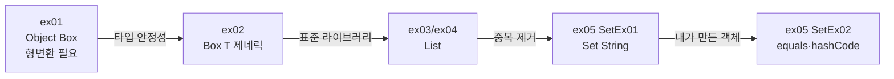

# Java20260522-제네릭 — 제네릭 · 컬렉션(List, Set) · equals/hashCode

> 📅 2026-05-22 | 🧭 [전체 로드맵으로](../README.md) | ◀ 이전: [인터페이스](../Java20260521-인터페이스/README.md) | ▶ 다음: [예외처리](../Java20260522-예외처리/README.md)

무엇이든 담을 수 있는 `Object` 상자의 **형변환 불편함**을 **제네릭 `Box<T>`** 로 해결하고,
제네릭이 실제로 쓰이는 대표 사례인 **컬렉션 프레임워크**(`List`, `Set`)를 다룹니다.
마지막으로 `Set`이 "같은 객체"를 판단하는 기준인 **`equals()` / `hashCode()`** 오버라이딩을 배웁니다.

---

## 1. 이 프로젝트에서 배우는 것

- `Object` 타입의 한계: 꺼낼 때마다 **다운캐스팅** 필요, 잘못 넣어도 컴파일 시 못 잡음
- **제네릭 클래스** `class Box<T>` 와 타입 지정 `Box<Car>`
- 다이아몬드 연산자 `new Box<>()`
- 기본형은 제네릭에 못 씀 → **래퍼 클래스** `Integer` + 오토박싱/언박싱
- `List` 인터페이스와 `ArrayList` / `LinkedList` 구현체
- `add`, `get`, `size`, `remove(index)`, `add(index, 값)`
- **향상된 for문** `for (int num : list)`
- `Set` — 중복 불가, `HashSet`(순서 없음) / `TreeSet`(정렬)
- 사용자 정의 객체를 `Set`에 넣을 때 **`equals` + `hashCode`** 재정의

## 2. 폴더 구조

```
Java20260522-제네릭/src/
├── ex01/BoxMain.java          Object 를 담는 Box (제네릭 이전)
├── ex02/
│   ├── Box.java               제네릭 Box<T>
│   └── BoxMain.java           Box<Car>, Box<Bus>, Box<Integer>
├── ex03/ArrayListEx01.java    List 기본 사용 (중복 O, 순서 O)
├── ex04/LinkedListEx01.java   LinkedList 사용
└── ex05/
    ├── SetEx01.java           Set<String> — 중복 제거 (TreeSet)
    ├── Person.java            equals / hashCode / toString 재정의
    └── SetEx02.java           Set<Person> — 같은 이름은 하나로
```

## 3. 학습 흐름



---

## 4. 예제별 상세

### ex01 · `Object` 박스 — 제네릭 이전
```java
class Box {
    Object item;                          // 모든 클래스의 조상 → 무엇이든 담김
    void   setItem(Object item) { this.item = item; }
    Object getItem()            { return item; }
}

Box box = new Box();
box.setItem(new Car());
Object obj2 = box.getItem();
Car car2 = (Car) obj2;    // ⚠ 꺼낼 때마다 다운캐스팅 필요
car2.func();
```
**문제점**
1. 꺼낼 때마다 `(Car)` 형변환이 필요하다.
2. `box.setItem("문자열")` 처럼 잘못 넣어도 **컴파일러가 막지 못하고**, 실행 중 `ClassCastException`이 난다.

### ex02 · 제네릭 `Box<T>` ⭐
```java
class Box<T> {          // T = 타입 파라미터 (Type)
    T item;
    void setItem(T item) { this.item = item; }
    T    getItem()       { return item; }
}

Box<Car> box = new Box<Car>();   // T → Car 로 확정
box.setItem(new Car());
// box.setItem("문자열");        // ❌ 컴파일 에러로 바로 잡아 줌
Car obj = box.getItem();         // ✅ 형변환 불필요

Box<Bus> box2 = new Box<Bus>();  // 같은 Box 코드를 Bus 용으로 재사용
Box<Integer> ibox = new Box<>(); // 다이아몬드: 오른쪽 타입 생략
ibox.setItem(10);                // 오토박싱: int 10 → Integer
int i = ibox.getItem();          // 언박싱: Integer → int
```
`Box.java` 하단 주석에는 `Box<Car>`, `Box<Bus>`로 지정했을 때 **T가 어떻게 치환되는지** 풀어서 적혀 있습니다.

**실행 결과**
```
Car 메소드 출력
ex02.Car@372f7a8d     ← Car 에 toString() 이 없어 클래스명@해시코드
Bus Class 출력
10
```

> **기본형 ↔ 래퍼 클래스**: 제네릭에는 객체 타입만 들어갑니다.
> `int→Integer`, `double→Double`, `char→Character`, `boolean→Boolean` …

### ex03 · `List` — 순서 O, 중복 O
```java
List<Integer> list = new LinkedList<>();   // 인터페이스 타입으로 선언 (구현체 교체 쉬움)
list.add(new Integer(10));   // 박싱 직접 (deprecated)
list.add(20);                // 오토박싱
list.add(55);
list.add(10);                // 중복 허용
list.add(45);

for (int i = 0; i < list.size(); i++) System.out.println(list.get(i));  // 인덱스 for
for (int num : list) System.out.println(num);                           // 향상된 for

list.remove(1);      // 인덱스 1(20) 삭제 → 뒤 요소들이 앞으로 당겨짐
list.add(1, 50);     // 인덱스 1 위치에 50 삽입
```
**실행 결과**
```
10 20 55 10 45      ← 넣은 순서 유지, 중복 10 도 그대로
------------------
10 20 55 10 45
------------------
10 55 10 45         ← remove(1)
------------------
10 50 55 10 45      ← add(1, 50)
```
(실제 출력은 한 줄에 하나씩)

### ex04 · `LinkedList`
ex03과 같은 연산을 `10, 20, 30, 40` 으로 수행합니다.
```
10 20 30 40  →  remove(1) → 10 30 40  →  add(1, 50) → 10 50 30 40
```

**ArrayList vs LinkedList**
| | ArrayList | LinkedList |
|---|---|---|
| 내부 구조 | 배열 | 노드끼리 연결 (이중 연결 리스트) |
| `get(i)` 조회 | 매우 빠름 | 느림 (처음부터 따라감) |
| 중간 삽입/삭제 | 느림 (뒤 요소 이동) | 위치를 찾은 뒤에는 빠름 |
| 맨 앞 삭제 | 느림 | 매우 빠름 |

> 실제 시간 차이는 [예외처리 프로젝트의 `ListPerformanceTest`](../Java20260522-예외처리/README.md)에서 측정합니다.

### ex05 · `SetEx01` — 중복 제거
```java
Set<String> set = new TreeSet<>();
set.add("kor"); set.add("eng"); set.add("math");
set.add("홍길동"); set.add("까미");
set.add("kor");   // 중복 → 무시
set.add("까미");  // 중복 → 무시
for (String str : set) System.out.println(str);
```
```
eng
kor
math
까미
홍길동
```
- 7번 넣었지만 **5개만** 저장됩니다.
- `TreeSet`은 **정렬된 순서**(영문 → 한글 사전순)로, `HashSet`은 **순서 보장 없이** 출력됩니다. (코드에 `HashSet` import가 남아 있어 바꿔 가며 비교해 볼 수 있습니다.)

### ex05 · `Person` + `SetEx02` — `equals` / `hashCode` ⭐
```java
public class Person {
    String name;

    @Override
    public boolean equals(Object obj) {
        if (this == obj) return true;                                 // ① 같은 주소
        if (obj == null || getClass() != obj.getClass()) return false; // ② null·타입 검사
        Person p = (Person) obj;                                      // ③ 다운캐스팅
        return Objects.equals(this.name, p.name);                     // ④ 값 비교
    }
    @Override
    public int hashCode() { return Objects.hash(name); }   // equals 가 같으면 hashCode 도 같아야 함

    @Override
    public String toString() { return "Person [name=" + name + "]"; }
}

Set<Person> set = new HashSet<>();
set.add(new Person("홍길동")); set.add(new Person("홍길동")); set.add(new Person("홍길동"));
set.add(new Person("까미"));   set.add(new Person("까미"));
```
```
Person [name=홍길동]
Person [name=까미]
```
**HashSet이 중복을 판단하는 순서**
```
① hashCode() 비교 ── 다르면 → 다른 객체 (저장)
        │ 같으면
        ▼
② equals() 비교 ──── false → 다른 객체 (저장)
                     true  → 같은 객체 (저장 안 함)
```
> `equals`/`hashCode`를 재정의하지 않으면 `new`로 만든 5개 객체는 **주소가 모두 달라** 5개 전부 저장됩니다.

---

## 5. 핵심 개념 정리

| 컬렉션 | 순서 | 중복 | 대표 구현체 | 주요 메소드 |
|---|:---:|:---:|---|---|
| `List` | O | O | `ArrayList`, `LinkedList` | `add`, `get`, `set`, `remove`, `size` |
| `Set` | X (Tree는 정렬) | X | `HashSet`, `TreeSet` | `add`, `remove`, `contains`, `size` |
| `Map` | X | 키 X | `HashMap` | `put`, `get` (이 프로젝트에선 미사용) |

- 변수 타입은 **인터페이스**(`List`, `Set`)로, 생성은 **구현체**(`new ArrayList<>()`)로 → 구현체를 바꿔도 나머지 코드는 그대로 (인터페이스 다형성)
- `Set`은 인덱스가 없어 `get(i)`가 없습니다. 향상된 for문으로 순회합니다.

## 6. 주의할 점 (코드 점검 메모)

- **ex03 `ArrayListEx01`**: 파일 이름은 ArrayList인데 실제로는 `new LinkedList<>()`를 사용합니다. ArrayList 예제로 쓰려면 `new ArrayList<>()`로 바꾸면 됩니다 (결과는 동일).
- **`new Integer(10)`** (ex03, ex04): Java 9부터 **deprecated(for removal)** 입니다. `Integer.valueOf(10)` 또는 그냥 `10`(오토박싱)을 사용하세요.
- **`list.remove(1)`의 함정**: `List<Integer>`에서 `remove(1)`은 **인덱스 1**을 지웁니다. **값 1**을 지우려면 `list.remove(Integer.valueOf(1))`.
- ex05 `Person.java`의 `import java.io.ObjectInputStream;`은 사용하지 않는 import입니다.

## 7. 연결

- ▶ 다음 단계: [예외처리](../Java20260522-예외처리/README.md) — 같은 날 진행한 프로젝트로, `ArrayList`/`LinkedList` **성능 비교**와 `Set`을 이용한 **로또 중복 제거**도 함께 들어 있습니다.
- 제네릭 함수형 인터페이스 `Predicate<T>`, `Function<T, R>`은 [람다](../Java20260525_익명객체/README.md)에서 사용합니다.
