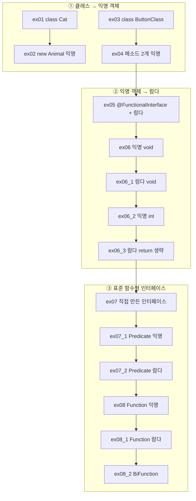

# Java20260525_익명객체 — 익명 객체 · 람다식 · 함수형 인터페이스

> 📅 2026-05-25 | 🧭 [전체 로드맵으로](../README.md) | ◀ 이전: [예외처리](../Java20260522-예외처리/README.md)

인터페이스를 구현하려면 지금까지는 **클래스를 따로 만들어야** 했습니다 (`class Cat implements Animal`).
이 프로젝트는 그 과정을 세 단계로 줄여 갑니다.

```
① 구현 클래스 작성      class Cat implements Animal { ... }   Animal an = new Cat();
② 익명 객체             Animal an = new Animal() { ... };     (클래스 이름 없이 바로 구현)
③ 람다식                ButtonClick bc = () -> System.out.println(...);
```

마지막으로 자바가 미리 만들어 둔 **표준 함수형 인터페이스** `Predicate`, `Function`, `BiFunction`을 사용합니다.

---

## 1. 이 프로젝트에서 배우는 것

- **익명 구현 객체**: `new 인터페이스() { 구현 };`
- 추상 메소드가 여러 개인 인터페이스의 익명 구현
- **함수형 인터페이스**와 `@FunctionalInterface` (추상 메소드 정확히 1개)
- **람다식** 문법 `(매개변수) -> { 실행문 }`
- 람다 축약 규칙: 매개변수 타입 생략, 괄호 생략, 중괄호·`return` 생략
- 반환값 없는 람다 vs 반환값 있는 람다
- `java.util.function` 패키지: `Predicate<T>`, `Function<T, R>`, `BiFunction<T, U, R>`

## 2. 폴더 구조

```
Java20260525_익명객체/src/
├── ex01/Main.java          interface Animal + class Cat (기존 방식)
├── ex02/Main.java          Animal 을 익명 객체로
├── ex03/Main.java          interface ButtonClick + class ButtonClass (기존 방식)
├── ex04/Main.java          메소드 2개짜리 ButtonClick 을 익명 객체로
├── ex05/Main.java          @FunctionalInterface + 람다
├── ex06/Main.java          Calculable(void)  — 익명 객체
├── ex06_1/Main.java        Calculable(void)  — 람다
├── ex06_2/Main.java        Calculable(int)   — 익명 객체
├── ex06_3/Main.java        Calculable(int)   — 람다 (return 생략)
├── ex07/PredicateMain.java    직접 만든 인터페이스로 짝수 판별 (람다)
├── ex07_1/PredicateMain.java  Predicate<Integer> — 익명 객체
├── ex07_2/PredicateMain.java  Predicate<Integer> — 람다
├── ex08/FunctionMain.java     Function<Integer,Integer> 제곱 — 익명 객체
├── ex08_1/FunctionMain.java   Function<Integer,Integer> 제곱 — 람다
└── ex08_2/FunctionMain.java   BiFunction<Integer,Integer,Double> 나누기 — 익명 객체
```
> `_1`, `_2`, `_3` 접미사는 **같은 문제를 다른 문법으로** 다시 푼 버전입니다. 나란히 비교하며 읽으세요.

## 3. 학습 흐름



---

## 4. 예제별 상세

### ex01 → ex02 · 구현 클래스 → 익명 객체
```java
interface Animal { void sound(); }

// ex01: 구현 클래스를 따로 작성
class Cat implements Animal {
    @Override public void sound() { System.out.println("야옹~"); }
}
Animal an = new Cat();

// ex02: 클래스 이름 없이 그 자리에서 구현 (익명 구현 객체)
Animal an = new Animal() {
    @Override public void sound() { System.out.println("야옹~"); }
};                // ⚠ 세미콜론 필수 (대입문의 끝)
an.sound();
```
결과: `야옹~` (두 예제 동일)

> 인터페이스는 `new Animal()` 할 수 없지만, 뒤에 `{ }` 로 **구현부를 바로 붙이면** 이름 없는 구현 클래스의 객체가 만들어집니다.
> 한 번만 쓰고 말 클래스라면 파일/이름을 만들 필요가 없습니다.

### ex03 → ex04 · 버튼 클릭 (메소드 2개)
```java
interface ButtonClick {
    void click();
    void doubleClick();
}
ButtonClick bc = new ButtonClick() {
    @Override public void click()       { System.out.println("버튼이 클릭이 되었요!"); }
    @Override public void doubleClick() { System.out.println("버튼을 떠블클릭했어요!"); }
};
bc.click();
bc.doubleClick();
```
```
버튼이 클릭이 되었요!
버튼을 떠블클릭했어요!
```
익명 객체는 추상 메소드가 **여러 개**여도 사용할 수 있습니다. (→ 람다는 1개일 때만 가능)

### ex05 · `@FunctionalInterface` + 첫 람다 ⭐
```java
@FunctionalInterface          // 추상 메소드가 1개가 아니면 컴파일 에러로 알려줌
interface ButtonClick {
    void click();
}
ButtonClick bc = () -> System.out.println("버튼이 클릭이 되었요!");
bc.click();
```
**익명 객체 → 람다 변환 과정**
```java
new ButtonClick() {
    @Override
    public void click() {                          // 메소드가 1개뿐이라 이름이 없어도 무엇인지 앎
        System.out.println("버튼이 클릭이 되었요!");
    }
};
          ↓  new 인터페이스(), 메소드 선언부를 지우고 -> 를 넣는다
() -> { System.out.println("버튼이 클릭이 되었요!"); }
          ↓  실행문이 한 줄이면 중괄호 생략
() -> System.out.println("버튼이 클릭이 되었요!")
```

### ex06 시리즈 · 계산기 — 익명 객체와 람다 비교 ⭐
| 파일 | 인터페이스 | 구현 방식 | 코드 |
|---|---|---|---|
| ex06 | `void calculate(int x, int y)` | 익명 객체 | `new Calculable() { public void calculate(int x, int y) { System.out.println(x+y); } }` |
| ex06_1 | `void calculate(int x, int y)` | 람다 | `(x, y) -> System.out.println(x + y)` |
| ex06_2 | `int calculate(int x, int y)` | 익명 객체 | `new Calculable() { public int calculate(int x, int y) { return x+y; } }` |
| ex06_3 | `int calculate(int x, int y)` | 람다 | `(x, y) -> x + y` |

모두 결과는 `11` (`calculate(5, 6)`).

**ex06_3 람다 return 규칙 (코드 주석 정리)**
```java
(x, y) -> { return x + y; }   // 중괄호를 쓰면 return 필수
(x, y) -> x + y               // 한 문장이면 중괄호와 return 을 함께 생략
// (x, y) -> return x + y;    ❌ 중괄호 없이 return 만 쓰는 것은 불가
```
- 매개변수 **타입(`int`)은 생략** 가능 — 인터페이스 선언에서 추론
- 매개변수가 **하나면 괄호도 생략** 가능 (`num -> ...`), 없거나 두 개 이상이면 괄호 필수

### ex07 시리즈 · 짝수 판별 — 직접 만든 인터페이스 → `Predicate`
> 문제: 정수를 받아 2의 배수면 `true`, 아니면 `false`를 반환하는 함수를 인터페이스로 설계하고 호출하라.

```java
// ex07: 인터페이스를 직접 설계
interface ADD { boolean add(int num); }
ADD a = num -> (num % 2 == 0) ? true : false;
a.add(8);   // true

// ex07_1: 표준 인터페이스 Predicate<T> — boolean test(T t)
Predicate<Integer> pre = new Predicate<Integer>() {
    @Override public boolean test(Integer num) { return (num % 2 == 0) ? true : false; }
};

// ex07_2: Predicate + 람다
Predicate<Integer> pre = num -> (num % 2 == 0) ? true : false;
pre.test(8);   // true
```
"정수를 받아 참/거짓을 돌려주는" 모양은 매우 흔하기 때문에, 자바가 **`Predicate<T>`** 로 미리 만들어 두었습니다. 인터페이스를 직접 설계할 필요가 없어집니다.

### ex08 시리즈 · 제곱 / 나누기 — `Function`, `BiFunction`
```java
// ex08: Function<입력, 출력> — R apply(T t)
Function<Integer, Integer> fun = new Function<Integer, Integer>() {
    @Override public Integer apply(Integer t) { return t * t; }
};
// ex08_1: 람다
Function<Integer, Integer> fun = t -> t * t;
fun.apply(5);   // 25

// ex08_2: BiFunction<입력1, 입력2, 출력> — R apply(T t, U u)
BiFunction<Integer, Integer, Double> f1 = new BiFunction<Integer, Integer, Double>() {
    @Override public Double apply(Integer t, Integer u) { return (double) t / u; }
};
f1.apply(5, 2);   // 2.5
```
| 파일 | 결과 |
|---|---|
| ex08, ex08_1 | `25` |
| ex08_2 | `2.5` |

---

## 5. 핵심 개념 정리

### 람다식 문법 요약
| 형태 | 예 |
|---|---|
| 매개변수 없음 | `() -> System.out.println("hi")` |
| 매개변수 1개 | `num -> num % 2 == 0` (괄호 생략 가능) |
| 매개변수 2개 | `(x, y) -> x + y` |
| 여러 문장 | `(x, y) -> { int s = x + y; return s; }` |

### 표준 함수형 인터페이스 (`java.util.function`)
| 인터페이스 | 추상 메소드 | 입력 → 출력 | 용도 | 이 프로젝트 |
|---|---|---|---|---|
| `Predicate<T>` | `boolean test(T t)` | T → boolean | 조건 검사 | ex07_1, ex07_2 |
| `Function<T, R>` | `R apply(T t)` | T → R | 값 변환 | ex08, ex08_1 |
| `BiFunction<T, U, R>` | `R apply(T t, U u)` | T, U → R | 두 값으로 계산 | ex08_2 |
| `Consumer<T>` | `void accept(T t)` | T → 없음 | 소비(출력 등) | — |
| `Supplier<T>` | `T get()` | 없음 → T | 값 공급 | — |

### 익명 객체 vs 람다
| | 익명 객체 | 람다 |
|---|---|---|
| 조건 | 인터페이스·추상 클래스 모두, 메소드 개수 무관 | **함수형 인터페이스**(추상 메소드 1개)만 |
| 코드 길이 | 길다 | 매우 짧다 |
| 사용 예 | ex02, ex04, ex06, ex06_2, ex07_1, ex08, ex08_2 | ex05, ex06_1, ex06_3, ex07, ex07_2, ex08_1 |

## 6. 주의할 점 (코드 점검 메모)

- `(num % 2 == 0) ? true : false` 는 그 자체가 이미 `boolean`이므로 **`num -> num % 2 == 0`** 으로 줄일 수 있습니다.
- **ex08_2**의 주석은 "제곱한 값을 돌려주는 메소드"로 ex08에서 복사된 채 남아 있지만, 실제로는 **두 수를 나눈 실수 값**을 반환합니다. 람다로는 `(t, u) -> (double) t / u`.
- **ex07**의 인터페이스 이름 `ADD`/메소드 `add`는 실제 기능(짝수 판별)과 맞지 않습니다 — `Predicate`의 `test`처럼 기능을 드러내는 이름이 좋습니다.
- `Predicate<Integer>`는 `Integer`(객체)를 받으므로 `int`가 **오토박싱**됩니다. 성능이 중요한 경우 `IntPredicate`, `IntFunction` 같은 기본형 전용 인터페이스도 있습니다.

## 7. 연결 — 지금까지의 흐름 되돌아보기

```
클래스(0515) → 상속(0519) → 인터페이스(0521) → 익명 객체 → 람다(0525)
                    │              │
                    └ 오버라이딩 ──┴── 구현을 "어디에 쓰느냐"의 변화
```
- 람다는 **컬렉션과 함께** 쓸 때 진가를 발휘합니다. 예를 들어 [제네릭](../Java20260522-제네릭/README.md)에서 배운 `List`에 대해
  `list.forEach(n -> System.out.println(n));`, `list.removeIf(n -> n % 2 == 0);` 처럼 쓸 수 있습니다.
- 다음 학습 주제로는 **Stream API** (`list.stream().filter(...).map(...)`)가 자연스럽게 이어집니다.

🧭 [전체 로드맵으로 돌아가기](../README.md)
