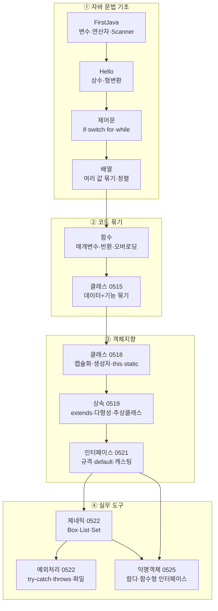

# ☕ Java 기초 → 객체지향 → 람다까지 (2026.05.11 ~ )

2026년 5월 11일부터 진행한 Java 수업의 실습 코드 저장소입니다.
**변수 한 줄 출력**에서 시작해 **클래스·상속·인터페이스·제네릭·컬렉션·예외처리·람다**까지
하루 단위로 쌓아 올린 12개의 Eclipse 프로젝트로 구성되어 있습니다.

각 프로젝트 폴더 안에 있는 `README.md`에 **예제별 목적 · 핵심 코드 · 실제 실행 결과 · 주의할 점**을 자세히 정리해 두었습니다.
이 문서는 그 전체를 묶는 **목차이자 학습 지도**입니다.

---

## 📘 학생용 Word 교안

완전 초보자를 위한 장별 Word 교안이 [`교안/`](교안/) 폴더에 있습니다. (총 13개 파일, 345쪽)

- **전체 한 번에 받기:** [교안/Java_기초_교안_전체.zip](교안/Java_기초_교안_전체.zip) → 파일 화면에서 오른쪽 위 **다운로드(⬇) 버튼**
- 각 장: 원본 예제 + 줄별 해설, 추가 설명 코드, 실제 실행 결과, 자주 하는 실수, 연습문제와 정답

| 파일 | 내용 |
|---|---|
| [00_교안_안내_및_학습로드맵.docx](교안/00_교안_안내_및_학습로드맵.docx) | 교안 사용법, 학습 로드맵, 실습 준비 |
| [01장_첫프로그램_변수_연산자.docx](교안/01장_첫프로그램_변수_연산자.docx) | FirstJava |
| [02장_상수와_형변환.docx](교안/02장_상수와_형변환.docx) | Hello |
| [03장_조건문과_반복문.docx](교안/03장_조건문과_반복문.docx) | Java20260513-제어문 |
| [04장_배열.docx](교안/04장_배열.docx) | Java20260514-배열 |
| [05장_함수_메소드.docx](교안/05장_함수_메소드.docx) | Java20260515-함수 |
| [06장_클래스_입문.docx](교안/06장_클래스_입문.docx) | Java20260515-클래스 |
| [07장_객체지향_심화_캡슐화_생성자_this_static.docx](교안/07장_객체지향_심화_캡슐화_생성자_this_static.docx) | Java20260518-클래스 |
| [08장_상속_다형성_추상클래스.docx](교안/08장_상속_다형성_추상클래스.docx) | Java20260519-상속 |
| [09장_인터페이스.docx](교안/09장_인터페이스.docx) | Java20260521-인터페이스 |
| [10장_제네릭과_컬렉션.docx](교안/10장_제네릭과_컬렉션.docx) | Java20260522-제네릭 |
| [11장_예외처리_입력_파일읽기.docx](교안/11장_예외처리_입력_파일읽기.docx) | Java20260522-예외처리 |
| [12장_익명객체와_람다.docx](교안/12장_익명객체와_람다.docx) | Java20260525_익명객체 |

---

## 📚 목차

1. [개발 환경](#-개발-환경)
2. [학습 로드맵 (프로젝트 한눈에 보기)](#-학습-로드맵)
3. [전체 학습 흐름도](#-전체-학습-흐름도)
4. [개념이 어떻게 이어지는가 — 스토리로 보는 흐름](#-개념이-어떻게-이어지는가)
5. [같은 예제가 진화하는 과정](#-같은-예제가-진화하는-과정)
6. [실행 방법](#-실행-방법)
7. [저장소 구조](#-저장소-구조)
8. [코드 점검 메모 요약](#-코드-점검-메모-요약)

---

## 🛠 개발 환경

| 항목 | 내용 |
|---|---|
| 언어 | Java (프로젝트 설정: **JavaSE-21**, compiler compliance 21) |
| IDE | Eclipse (각 폴더에 `.project`, `.classpath`, `.settings/` 포함) |
| 소스 위치 | 각 프로젝트의 `src/` 아래 패키지(`ex01`, `ex02` …) 단위 |
| 인코딩 | UTF-8 (한글 주석·출력 포함) |
| 외부 라이브러리 | 없음 (JDK 표준 라이브러리만 사용) |

> 모든 코드는 Java 17 이상에서도 컴파일·실행됩니다. (Java 21 전용 문법은 사용하지 않음)

---

## 🗺 학습 로드맵

| 순서 | 날짜 | 프로젝트 | 주제 | 핵심 키워드 |
|:---:|:---:|---|---|---|
| 1 | 과정 첫 주 | [FirstJava](FirstJava/README.md) | 첫 프로그램 · 변수 · 연산자 | `main`, `println`, `int/double/String`, `++`, `%`, `Scanner` |
| 2 | 과정 첫 주 | [Hello](Hello/README.md) | 상수 · 형변환 | `final`, 자동/강제 형변환, 오버플로 |
| 3 | 05/13 | [Java20260513-제어문](Java20260513-제어문/README.md) | 조건문 · 반복문 | `if/else if`, 삼항연산자, `switch`, `for/while/do-while`, `break/continue` |
| 4 | 05/14 | [Java20260514-배열](Java20260514-배열/README.md) | 배열 | `new int[5]`, `length`, 최대/최소, 평균, 버블정렬, swap |
| 5 | 05/15 | [Java20260515-함수](Java20260515-함수/README.md) | 함수(메소드) | 매개변수, 반환값, `void`, `return`, **오버로딩** |
| 6 | 05/15 | [Java20260515-클래스](Java20260515-클래스/README.md) | 클래스 입문 | 변수 나열 → 함수 → **클래스**, `new`, 생성자, `private` |
| 7 | 05/18 | [Java20260518-클래스](Java20260518-클래스/README.md) | 객체지향 심화 | 절차지향 vs 객체지향, 캡슐화, Getter/Setter, 생성자 오버로딩, `this`, `static` |
| 8 | 05/19 | [Java20260519-상속](Java20260519-상속/README.md) | 상속 · 다형성 · 추상클래스 | `extends`, `super`, 업캐스팅, `@Override`, `toString`, 싱글톤, `abstract` |
| 9 | 05/21 | [Java20260521-인터페이스](Java20260521-인터페이스/README.md) | 인터페이스 | `interface`, `implements`, `default` 메소드, 다운캐스팅 |
| 10 | 05/22 | [Java20260522-제네릭](Java20260522-제네릭/README.md) | 제네릭 · 컬렉션 | `Box<T>`, `List`, `ArrayList/LinkedList`, `Set`, `equals/hashCode` |
| 11 | 05/22 | [Java20260522-예외처리](Java20260522-예외처리/README.md) | 예외처리 · 입력 · 파일 | `try/catch/finally`, `throws`, 예외 전파, `Scanner` 함정, `FileReader`, 성능비교, 로또 |
| 12 | 05/25 | [Java20260525_익명객체](Java20260525_익명객체/README.md) | 익명객체 · 람다 · 함수형 인터페이스 | 익명 구현 객체, `->`, `@FunctionalInterface`, `Predicate`, `Function`, `BiFunction` |

---

## 🔀 전체 학습 흐름도



---

## 🧭 개념이 어떻게 이어지는가

수업은 **"앞 단계의 불편함을 다음 단계가 해결한다"** 는 흐름으로 진행됩니다.

| 단계 | 불편함 (문제) | 해결책 (다음 개념) |
|---|---|---|
| 변수 | 값을 하나씩만 저장할 수 있다 | → **배열**로 같은 종류의 값을 묶는다 |
| 같은 코드 반복 | `println` 4줄을 4번 복사한다 (`FunctionEx01`) | → **함수**로 묶고 이름으로 호출한다 (`FunctionEx02`) |
| 비슷한 함수가 여러 개 | `add`, `thrid`, `four`, `dadd` … 이름이 제각각 (`FunctionEx07`) | → **오버로딩**으로 같은 이름 `add` 하나로 (`FunctionEx08`) |
| 학생 정보가 흩어짐 | `name1, age1, phone1, name2 …` 변수 폭발 (`ClassEx01`) | → **클래스**로 이름·나이·전화를 한 덩어리로 (`ClassEx03`) |
| 아무나 값을 바꿈 | `hong.age = -100` 같은 값이 들어감 | → **`private` + Getter/Setter** 로 캡슐화 (`0518 ex03`) |
| 객체 만들고 값 넣기 번거로움 | `new` 후 필드를 하나씩 대입 | → **생성자**로 생성과 동시에 초기화 (`ClassEx04`, `0518 ex04`) |
| 생성자 코드 중복 | 생성자마다 같은 대입문 반복 | → **`this(...)`** 로 다른 생성자 호출 (`0518 ex06`) |
| 계좌별 함수·변수를 따로 만듦 | `deposit2`, `balance2` … (`ProceduralEx`) | → **객체**마다 자기 상태를 가진다 (`0518 ex02`) |
| Dog, Cat에 같은 코드 | `eat()`, `sleep()` 중복 | → **상속**으로 `Animal`에 한 번만 (`0519 ex01`) |
| 자식마다 동작이 다름 | `test()`가 클래스마다 달라야 함 | → **오버라이딩 + 다형성** (`0519 ex06`) |
| "반드시 구현하라"를 강제하고 싶음 | 부모 메소드를 안 고쳐도 컴파일됨 | → **추상 클래스 / 인터페이스** (`0519 ex12`, `0521`) |
| `Object`로 받으면 형변환 필요 | `(Car)box.getItem()` 실수 위험 | → **제네릭** `Box<Car>` (`제네릭 ex01 → ex02`) |
| 배열 크기가 고정 | 추가·삭제가 어려움 | → **컬렉션** `List`, `Set` (`제네릭 ex03~05`) |
| 잘못된 입력이면 프로그램이 죽음 | `0`으로 나누기, 문자 입력 | → **예외처리** `try-catch` (`예외처리 Sample00`) |
| 한 번 쓰고 버릴 클래스도 파일로 만듦 | `class Cat implements Animal` | → **익명 객체** → **람다** (`익명객체 ex01 → ex02 → ex05`) |

---

## 🔁 같은 예제가 진화하는 과정

수업에서는 **같은 주제를 조금씩 고쳐 가며** 새로운 개념을 보여 줍니다. 아래 흐름을 따라 읽으면 "왜 이 문법이 필요한가"가 자연스럽게 이해됩니다.

### 1) 학생/회원 정보 관리
```
ClassEx01  변수 12개 나열
   ↓  중복 출력 코드를 함수로
ClassEx02  memberInfo(name, age, phone)
   ↓  데이터와 기능을 하나로
ClassEx03  class Member { name, age, phone, memberInfo() }
   ↓  private + 생성자
ClassEx04  new Member("홍길동", 20, "010-...")
   ↓  성적 처리로 응용
ClassEx05/06  Student.total(), avg() (출력형 → 반환형)
```

### 2) 은행 계좌 (Java20260518-클래스)
```
ex01 ProceduralEx   static 변수/함수로 계좌 2개 → balance2, deposit2 …
ex02 Account 클래스 객체마다 잔고 보유
ex03 유효성 검사     마이너스 입금 / 잔고 부족 출금 차단 + Getter/Setter
ex04 생성자          new Account(3000)
ex05 생성자 오버로딩  (), (int), (String, int) + 이름
ex06 this(...)       생성자 체이닝으로 중복 제거
ex07 static 변수     클래스 변수 max 추가
```

### 3) 동물 (Java20260519-상속 → 익명객체)
```
상속 ex01  Animal ← Dog, Cat (부모 생성자 자동 호출)
상속 ex02  super(name, ...) 로 부모에 값 전달
상속 ex04  Animal a = new Dog();  업캐스팅
상속 ex12  abstract class Animal { abstract void sound(); }
익명 ex01  interface Animal + class Cat
익명 ex02  new Animal() { ... }  익명 객체
```

### 4) 계산기 → 람다 (Java20260525_익명객체)
```
ex06   익명 객체로 Calculable 구현 (void)
ex06_1 람다  (x, y) -> System.out.println(x + y)
ex06_2 익명 객체 (int 반환)
ex06_3 람다  (x, y) -> x + y        ← return·중괄호 생략
ex07   직접 만든 인터페이스 → ex07_1/07_2 표준 Predicate<Integer>
ex08   Function<Integer,Integer>  → ex08_2 BiFunction
```

---

## ▶ 실행 방법

### Eclipse
1. `File > Import > General > Existing Projects into Workspace`
2. 저장소 루트 폴더 선택 → 12개 프로젝트가 모두 표시됨 → `Finish`
3. 실행할 클래스를 열고 `Ctrl + F11` (Run As > Java Application)

> `Java20260522-예외처리/src/ex/TestEx.java`는 `src/ex/test.txt`를 **상대경로**로 읽습니다.
> Eclipse는 프로젝트 폴더를 작업 디렉터리로 쓰기 때문에 그대로 실행하면 됩니다.

### 명령줄 (JDK 17+)
```bash
cd Java20260519-상속
javac -encoding UTF-8 -d bin src/ex13/*.java
java -cp bin ex13.MobileTest
```

---

## 📁 저장소 구조

```
Java_20260511/
├── README.md                    ← 지금 이 문서 (전체 지도)
├── FirstJava/                   ← 1. 첫 프로그램, 변수, 연산자
├── Hello/                       ← 2. 상수, 형변환
├── Java20260513-제어문/          ← 3. if, switch, for, while
├── Java20260514-배열/            ← 4. 배열, 정렬
├── Java20260515-함수/            ← 5. 메소드, 오버로딩
├── Java20260515-클래스/          ← 6. 클래스 입문
├── Java20260518-클래스/          ← 7. 캡슐화, 생성자, this, static
├── Java20260519-상속/            ← 8. 상속, 다형성, 추상 클래스
├── Java20260521-인터페이스/       ← 9. 인터페이스
├── Java20260522-제네릭/          ← 10. 제네릭, 컬렉션
├── Java20260522-예외처리/         ← 11. 예외처리, Scanner, 파일 읽기
├── Java20260525_익명객체/         ← 12. 익명 객체, 람다
├── git_JAVA.sh                  ← add → commit → push 한 번에 하는 스크립트
├── git_JAVA.txt                 ← (Java와 무관) HTML/CSS 가로 내비게이션 메뉴 예제
└── .gitignore                   ← Eclipse .metadata/ 제외
```

각 프로젝트 폴더 구조는 동일합니다.
```
프로젝트/
├── README.md          ← 프로젝트 상세 설명
├── .project / .classpath / .settings/   ← Eclipse 설정
└── src/
    └── ex01/, ex02/ …  ← 예제 단위 패키지 (같은 클래스 이름을 패키지로 분리)
```

> 💡 **왜 `ex01`, `ex02` … 패키지로 나누나요?**
> `Account`, `Animal`, `Main` 같은 같은 이름의 클래스를 단계별로 다시 만들기 위해서입니다.
> 패키지가 다르면 같은 이름의 클래스가 공존할 수 있습니다.

---

## 📝 코드 점검 메모 요약

문서를 작성하면서 모든 예제를 직접 컴파일·실행해 보았습니다. 학습용 코드라 의도적인 부분도 있지만,
복습할 때 헷갈릴 수 있는 지점을 각 프로젝트 README의 **"주의할 점"** 에 적어 두었습니다. 주요 항목은 다음과 같습니다.

| 프로젝트 | 파일 | 내용 |
|---|---|---|
| 제어문 | `BreakExam01` | 주사위인데 `Math.random()*45`로 1~45가 나옴 → `*6`이 의도 |
| 제어문 | `ForEx04` | 주석은 "2~5단"이지만 실제로는 2~9단을 `j == i`에서 끊어 **삼각형** 출력 |
| 상속 | `ex09/Student` | `number`, `major`가 `static` → 세 학생 모두 마지막 값(`201103 컴공`)으로 출력 |
| 상속 | `ex10/Friend` | `getInfo()` 오버라이딩이 주석 처리 → 이름만 출력 (ex11에서 `toString`으로 해결) |
| 상속 | `ex08/ProductTest` | 문제는 "천 단위 콤마"인데 미구현 → `String.format("%,d원", price)` |
| 인터페이스 | `ex03/Company` | 인센티브 지급·세금 출력(`isTax == true`) 부분이 미완성 |
| 제네릭 | `ex03/ArrayListEx01` | 파일명은 ArrayList인데 `new LinkedList<>()` 사용 |
| 제네릭 | `ex03`, `ex04` | `new Integer(10)` 은 Java 9부터 deprecated → `Integer.valueOf(10)` 또는 `10` |
| 예외처리 | `Sample00` | `catch (Exception e)`가 0으로 나누기도 잡아 "정수만 입력 가능합니다"로 잘못 안내 |
| 예외처리 | `Sample04` | 지역(`local`)을 `"나이: "`로 출력 |

---

> 각 프로젝트의 상세 설명은 위 [학습 로드맵](#-학습-로드맵) 표의 링크를 눌러 확인하세요.
